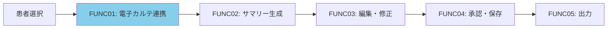
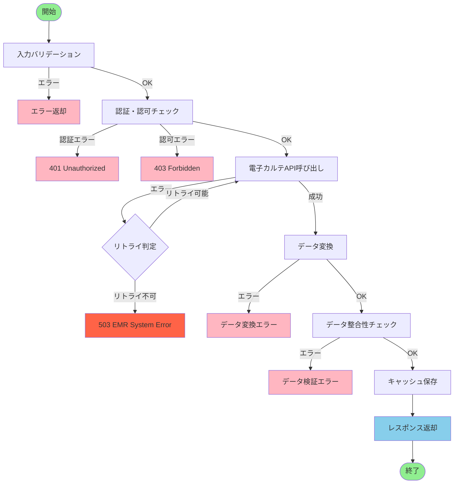
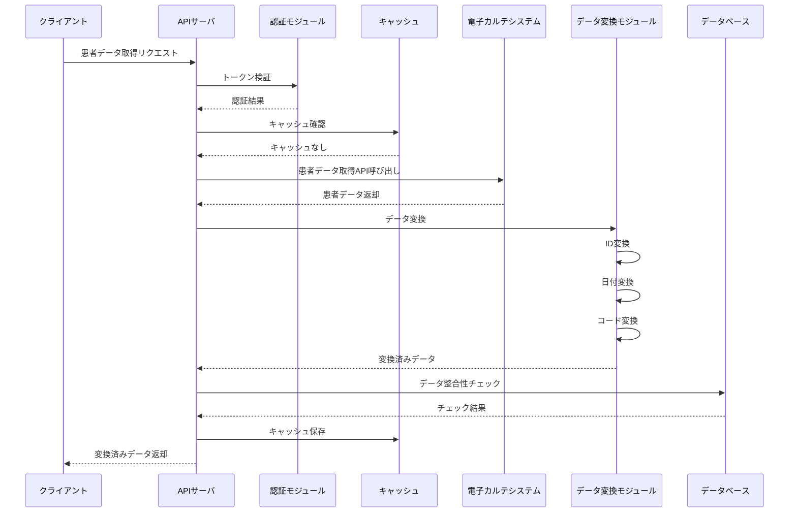
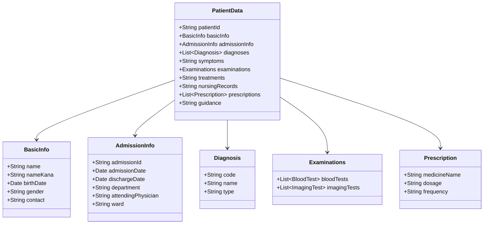
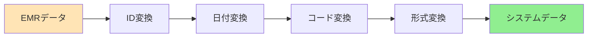
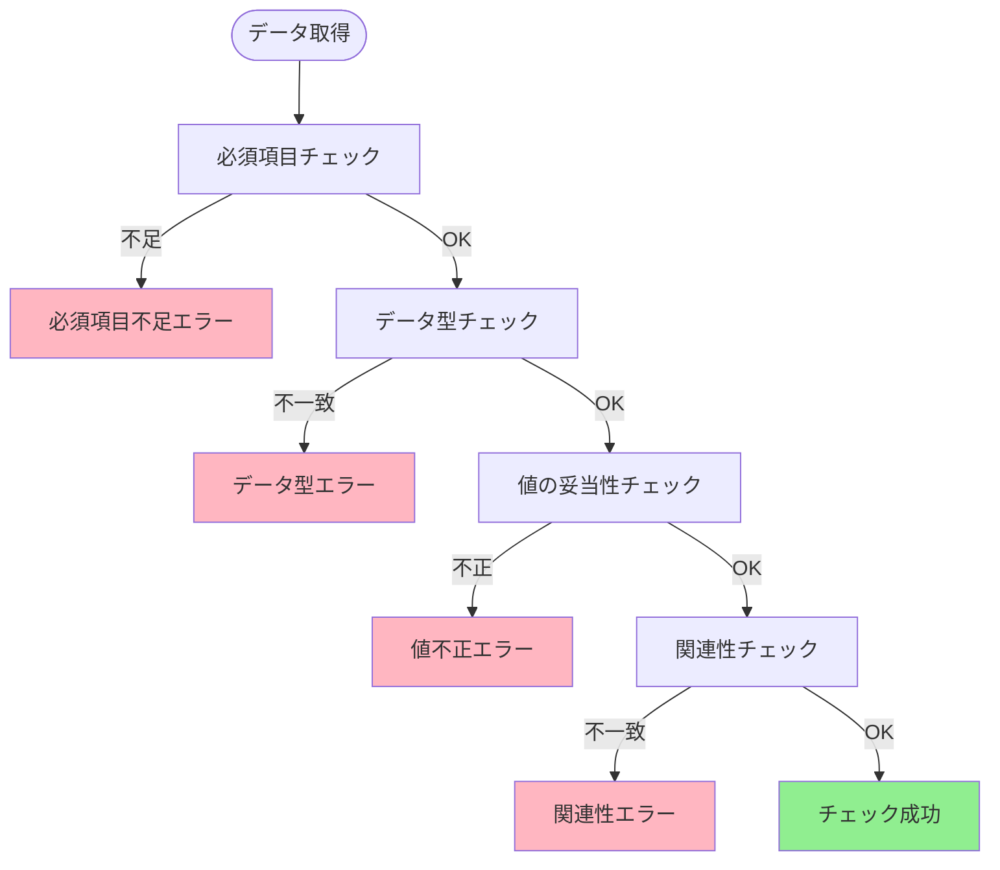
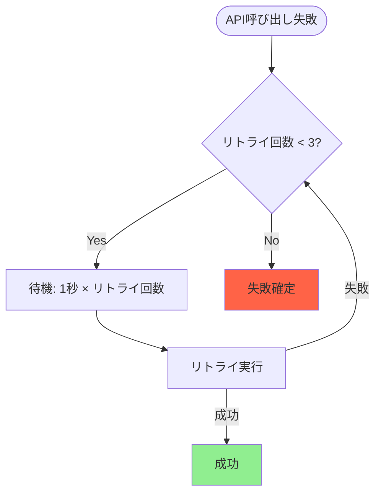
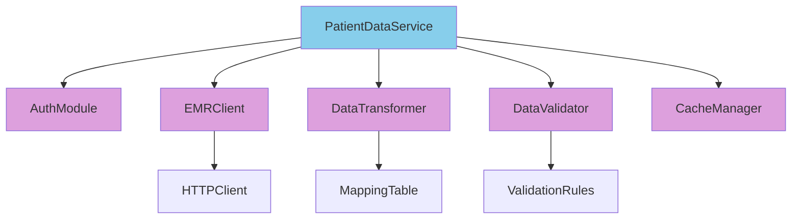
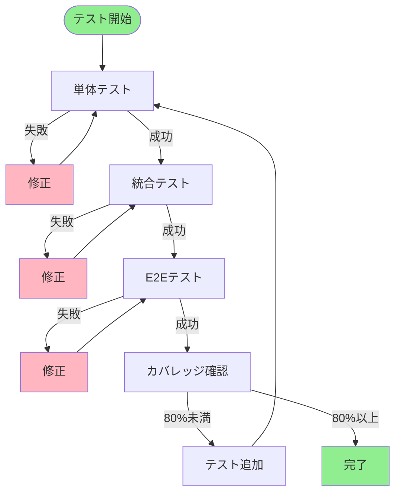

# 機能詳細設計書 - FUNC01: 電子カルテ連携機能

## 1. ドキュメント情報

| 項目 | 内容 |
|---|---|
| 機能ID | FUNC01 |
| 機能名 | 電子カルテ連携機能 |
| 対応要件ID | REQ01, REQ12-REQ19 |
| バージョン | 1.0 |
| 作成日 | 2025年01月15日 |
| 関連ドキュメント | 基本設計書（docs/design/basic_design.md） |

## 2. 機能概要

対象患者の電子カルテシステムから、API等を通じて退院時サマリー作成に必要なデータ（患者基本情報、病名、検査結果、治療経過等）を安全に取得する機能。

### 2.1 機能の位置づけ

## 3. 処理フロー

### 3.1 全体フロー

### 3.2 シーケンス図

## 4. 入力仕様

### 4.1 APIエンドポイント

- **エンドポイント**: `GET /api/v1/patients/{patientId}`
- **メソッド**: GET
- **認証**: Bearer Token必須

### 4.2 リクエストパラメータ

| パラメータ名 | 型 | 位置 | 必須 | 説明 | 制約条件 |
|---|---|---|---|---|---|
| patientId | String | Path | 必須 | 患者ID | 20文字以内、英数字 |
| admissionId | String | Query | 任意 | 入院ID | 20文字以内、英数字 |

### 4.3 リクエストヘッダー

| ヘッダー名 | 型 | 必須 | 説明 |
|---|---|---|---|
| Authorization | String | 必須 | Bearer {token} |
| Content-Type | String | 必須 | application/json |

## 5. 出力仕様

### 5.1 成功レスポンス

**HTTPステータス**: 200 OK

**レスポンス項目**:

| 項目名 | データ型 | 説明 |
|---|---|---|
| patientId | String | 患者ID |
| basicInfo | Object | 患者基本情報（氏名、生年月日、性別、連絡先） |
| admissionInfo | Object | 入院情報（入院日、退院日、診療科、主治医、病棟） |
| diagnoses | Array | 病名情報（ICD-10コード、病名、種別） |
| symptoms | String | 主要症状・所見 |
| examinations | Object | 検査結果（血液検査、画像検査） |
| treatments | String | 治療経過 |
| nursingRecords | String | 看護記録 |
| prescriptions | Array | 退院時処方（薬剤名、用量、頻度） |
| guidance | String | 退院後の療養指導 |

### 5.2 データ構造図

## 6. 処理詳細

### 6.1 データ変換処理フロー

### 6.2 データ変換ルール

#### 6.2.1 ID変換

| 変換元 | 変換先 | 変換ルール |
|---|---|---|
| EMR患者ID | システム患者ID | IDマッピングテーブル参照、存在しない場合は新規作成 |

#### 6.2.2 日付変換

| 変換元形式 | 変換先形式 | 変換ルール |
|---|---|---|
| YYYYMMDD | YYYY-MM-DD | 文字列分割とハイフン挿入 |

#### 6.2.3 コード変換

| 変換元 | 変換先 | 変換ルール |
|---|---|---|
| EMR病名コード | ICD-10コード | コード変換テーブル参照 |

### 6.3 データ整合性チェックフロー

### 6.4 必須項目チェック

| 項目 | 必須/任意 | チェック内容 |
|---|---|---|
| 患者ID | 必須 | 空でない、20文字以内 |
| 氏名 | 必須 | 空でない、100文字以内 |
| 生年月日 | 必須 | 有効な日付形式 |
| 性別 | 必須 | 指定された値のいずれか |
| 入院日 | 必須 | 有効な日付形式 |
| 診療科 | 必須 | 空でない |
| 主治医 | 必須 | 空でない |

## 7. エラーハンドリング

### 7.1 エラー一覧

| HTTPステータス | エラーコード | 説明 | 処理内容 |
|---|---|---|---|
| 400 | INVALID_PATIENT_ID | 無効な患者ID | エラーメッセージを返却 |
| 401 | UNAUTHORIZED | 認証エラー | 認証失敗メッセージを返却、ログイン画面へリダイレクト |
| 403 | FORBIDDEN | 認可エラー | アクセス権限なしメッセージを返却 |
| 404 | PATIENT_NOT_FOUND | 患者が見つからない | エラーメッセージを返却 |
| 500 | INTERNAL_ERROR | サーバーエラー | エラーログを記録、エラーメッセージを返却 |
| 503 | EMR_SYSTEM_ERROR | 電子カルテシステムエラー | エラーログを記録、リトライ処理を実施（最大3回） |
| 500 | DATA_CONVERSION_ERROR | データ変換エラー | エラーログを記録、部分的なデータを返却 |

### 7.2 リトライ処理フロー

## 8. モジュール設計

### 8.1 モジュール構成図

### 8.2 モジュール責務

| モジュール名 | 責務 | 主要処理 |
|---|---|---|
| PatientDataService | 患者データ取得のオーケストレーション | 全体フローの制御、各モジュールの呼び出し |
| AuthModule | 認証・認可処理 | トークン検証、権限チェック |
| EMRClient | 電子カルテシステムとの通信 | API呼び出し、リトライ処理 |
| DataTransformer | データ変換処理 | ID変換、日付変換、コード変換 |
| DataValidator | データ整合性チェック | 必須項目チェック、データ型チェック、値の妥当性チェック |
| CacheManager | キャッシュ管理 | キャッシュの保存、取得、無効化 |

## 9. テスト設計（TDD）

### 9.1 テスト方針

- TDD（Test-Driven Development）で実装
- 単体テスト、統合テスト、E2Eテストを実施
- テストカバレッジ80%以上を目標

### 9.2 テスト実行フロー

### 9.3 テストケース一覧

#### TC-FUNC01-001: 正常系 - 患者データ取得成功

**Given**: 
- 有効な患者ID（P001）が指定されている
- 認証トークンが有効である
- 電子カルテシステムが正常に動作している

**When**: 
- 患者データ取得APIを呼び出す

**Then**: 
- HTTPステータス200が返却される
- 患者基本情報、入院情報、病名情報、検査結果、治療経過が含まれる
- データが正しく変換されている

#### TC-FUNC01-002: 異常系 - 患者IDが無効

**Given**: 
- 無効な患者ID（空文字）が指定されている

**When**: 
- 患者データ取得APIを呼び出す

**Then**: 
- HTTPステータス400が返却される
- エラーコード `INVALID_PATIENT_ID` が返却される
- エラーメッセージが返却される

#### TC-FUNC01-003: 異常系 - 認証トークンが無効

**Given**: 
- 無効な認証トークンが指定されている

**When**: 
- 患者データ取得APIを呼び出す

**Then**: 
- HTTPステータス401が返却される
- エラーコード `UNAUTHORIZED` が返却される

#### TC-FUNC01-004: 異常系 - 患者が見つからない

**Given**: 
- 存在しない患者ID（P999）が指定されている
- 認証トークンが有効である

**When**: 
- 患者データ取得APIを呼び出す

**Then**: 
- HTTPステータス404が返却される
- エラーコード `PATIENT_NOT_FOUND` が返却される

#### TC-FUNC01-005: 異常系 - 電子カルテシステムエラー

**Given**: 
- 有効な患者IDが指定されている
- 電子カルテシステムがエラーを返す

**When**: 
- 患者データ取得APIを呼び出す

**Then**: 
- リトライ処理が最大3回実行される
- リトライ後も失敗した場合、HTTPステータス503が返却される
- エラーコード `EMR_SYSTEM_ERROR` が返却される

#### TC-FUNC01-006: 正常系 - キャッシュからデータ取得

**Given**: 
- 有効な患者IDが指定されている
- 該当データがキャッシュに存在する

**When**: 
- 患者データ取得APIを呼び出す

**Then**: 
- 電子カルテシステムを呼び出さない
- キャッシュからデータを返却する
- HTTPステータス200が返却される

#### TC-FUNC01-007: 正常系 - 入院ID指定でデータ取得

**Given**: 
- 有効な患者ID（P001）と入院ID（A001）が指定されている

**When**: 
- 患者データ取得APIを入院ID付きで呼び出す

**Then**: 
- HTTPステータス200が返却される
- 指定された入院IDのデータが返却される

#### TC-FUNC01-008: 異常系 - データ変換エラー

**Given**: 
- 有効な患者IDが指定されている
- 電子カルテから不正な形式のデータが返却される

**When**: 
- 患者データ取得APIを呼び出す

**Then**: 
- HTTPステータス500が返却される
- エラーコード `DATA_CONVERSION_ERROR` が返却される
- エラーログが記録される

#### TC-FUNC01-009: 異常系 - データ整合性チェックエラー

**Given**: 
- 有効な患者IDが指定されている
- 必須項目が欠落しているデータが返却される

**When**: 
- 患者データ取得APIを呼び出す

**Then**: 
- HTTPステータス500が返却される
- エラーコード `DATA_VALIDATION_ERROR` が返却される
- 不足している項目がエラーメッセージに含まれる

#### TC-FUNC01-010: 正常系 - データ変換（ID変換）

**Given**: 
- EMR患者ID "EMR001" が存在する
- IDマッピングテーブルに "EMR001" -> "P001" のマッピングが存在する

**When**: 
- データ変換処理を実行する

**Then**: 
- システム患者ID "P001" に変換される

#### TC-FUNC01-011: 正常系 - データ変換（日付変換）

**Given**: 
- EMR日付形式 "20240101" が存在する

**When**: 
- 日付変換処理を実行する

**Then**: 
- システム日付形式 "2024-01-01" に変換される

#### TC-FUNC01-012: 正常系 - データ変換（コード変換）

**Given**: 
- EMR病名コード "HT001" が存在する
- コード変換テーブルに "HT001" -> "I10" のマッピングが存在する

**When**: 
- コード変換処理を実行する

**Then**: 
- ICD-10コード "I10" に変換される

## 10. パフォーマンス要件

| 項目 | 目標値 | 測定方法 |
|---|---|---|
| API応答時間 | 1秒以内（95パーセンタイル） | リクエスト受信からレスポンス返却まで |
| キャッシュヒット率 | 70%以上 | キャッシュからの取得回数 / 総リクエスト数 |
| 同時リクエスト数 | 100リクエスト/秒 | システム全体の負荷テスト |

## 11. セキュリティ要件

| 項目 | 要件 |
|---|---|
| 認証 | Bearer Token必須、トークン有効期限チェック |
| 認可 | 患者データへのアクセス権限チェック |
| 通信暗号化 | TLS 1.3以上 |
| ログ記録 | すべてのアクセスを監査ログに記録 |
| 個人情報保護 | データマスキング、匿名化処理 |

## 12. 更新履歴

| バージョン | 更新日 | 更新内容 | 更新者 |
|---|---|---|---|
| 1.0 | 2025年01月15日 | 初版作成 | {作成者名} |

