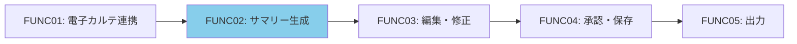
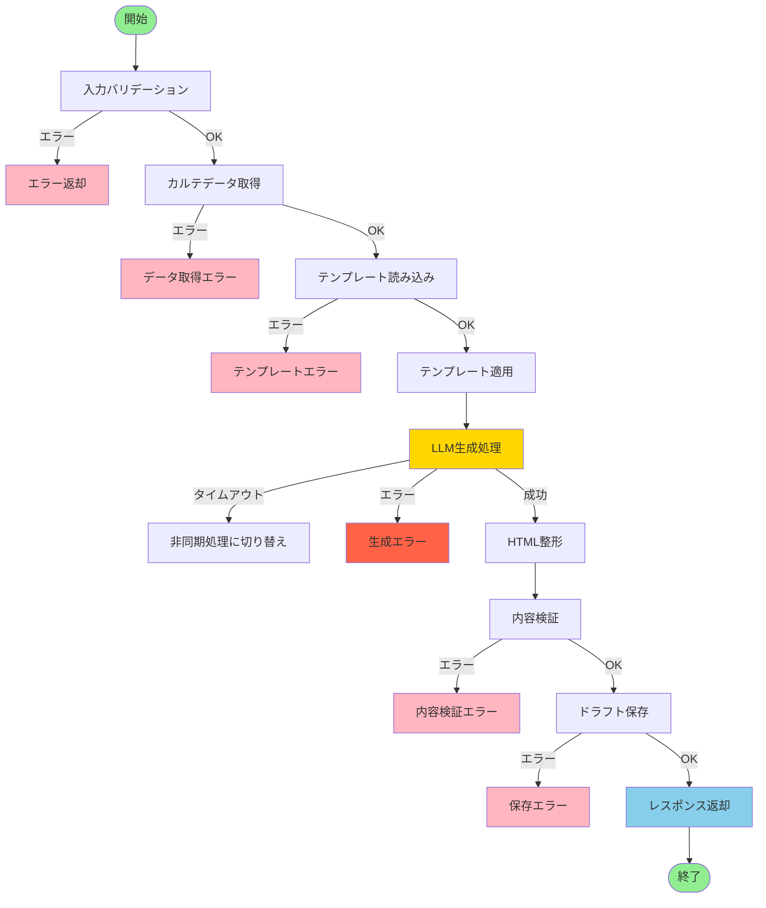
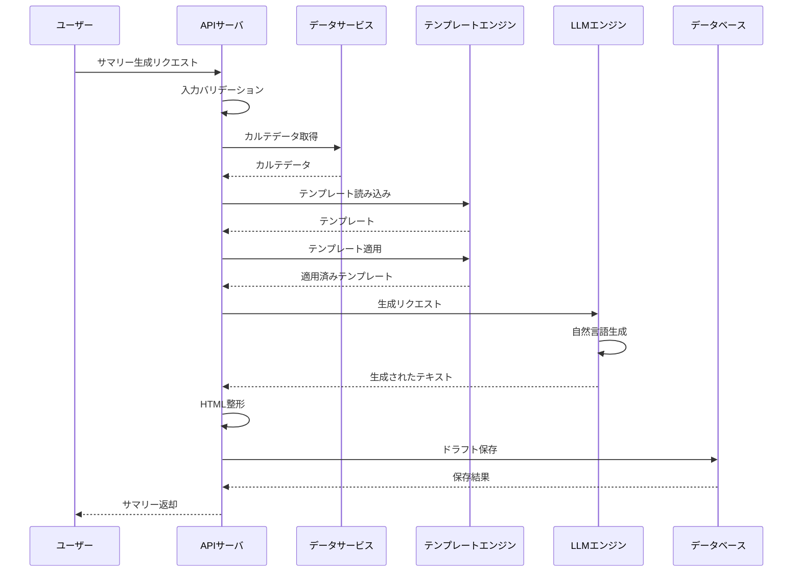
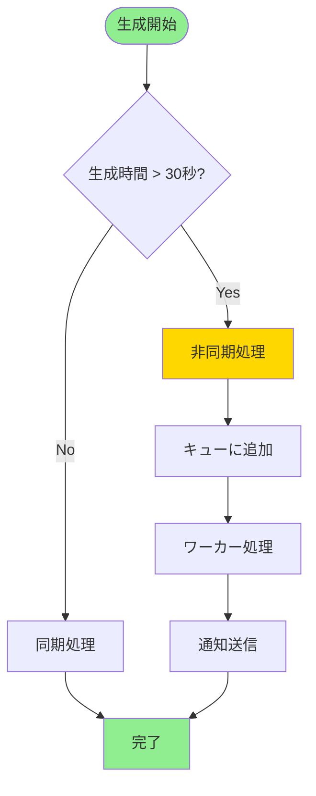
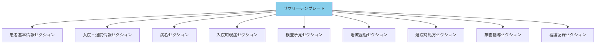
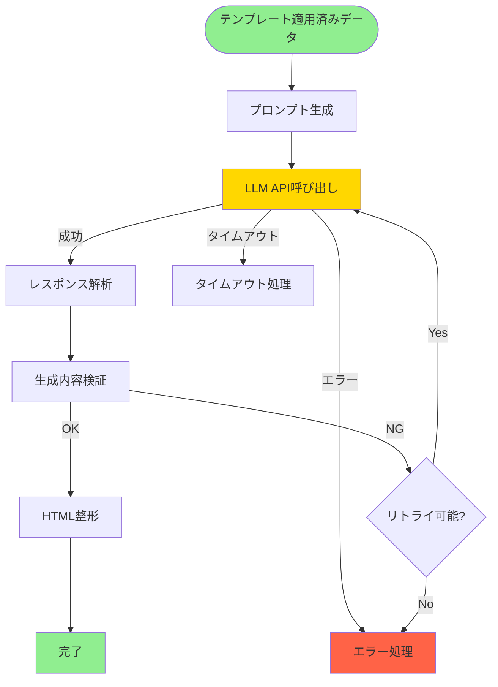
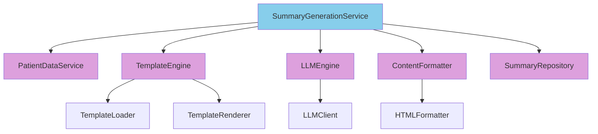
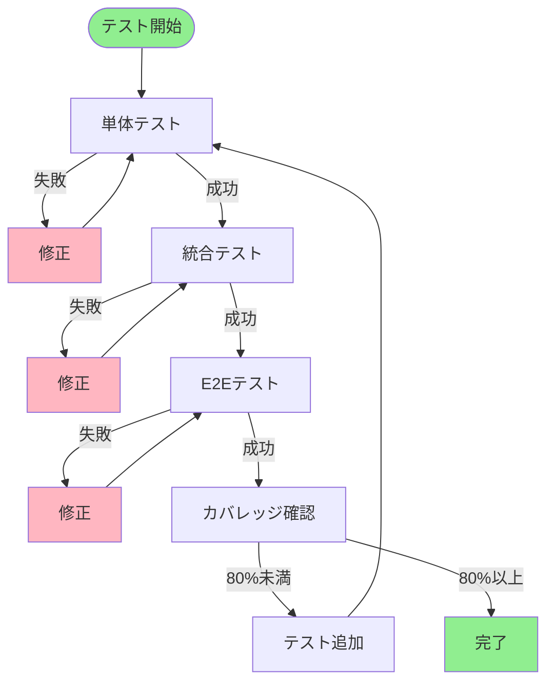

# 機能詳細設計書 - FUNC02: 退院時サマリー自動生成機能

## 1. ドキュメント情報

| 項目 | 内容 |
|---|---|
| 機能ID | FUNC02 |
| 機能名 | 退院時サマリー自動生成機能 |
| 対応要件ID | REQ02 |
| バージョン | 1.0 |
| 作成日 | 2025年01月15日 |
| 関連ドキュメント | 基本設計書（docs/design/basic_design.md） |

## 2. 機能概要

取得した電子カルテ情報を基に、所定のテンプレートに従って退院時サマリーのドラフトを自然言語生成技術を用いて自動で作成する機能。

### 2.1 機能の位置づけ

## 3. 処理フロー

### 3.1 全体フロー

### 3.2 シーケンス図

### 3.3 非同期処理フロー

## 4. 入力仕様

### 4.1 APIエンドポイント

- **エンドポイント**: `POST /api/v1/summaries/generate`
- **メソッド**: POST
- **認証**: Bearer Token必須

### 4.2 リクエストパラメータ

| パラメータ名 | 型 | 必須 | 説明 | 制約条件 | デフォルト値 |
|---|---|---|---|---|---|
| patientId | String | 必須 | 患者ID | 20文字以内 | - |
| admissionId | String | 必須 | 入院ID | 20文字以内 | - |
| options | Object | 任意 | 生成オプション | - | - |
| options.templateVersion | String | 任意 | テンプレートバージョン | "1.0" | "1.0" |
| options.includeNursingRecords | Boolean | 任意 | 看護記録を含めるか | true/false | true |

## 5. 出力仕様

### 5.1 成功レスポンス

**HTTPステータス**: 201 Created

**レスポンス項目**:

| 項目名 | データ型 | 説明 |
|---|---|---|
| summaryId | String | サマリーID |
| patientId | String | 患者ID |
| admissionId | String | 入院ID |
| status | String | ステータス（draft） |
| content | String | HTML形式のサマリー内容 |
| version | Integer | バージョン番号 |
| createdAt | DateTime | 作成日時 |
| createdBy | String | 作成者 |

### 5.2 非同期処理レスポンス

**HTTPステータス**: 202 Accepted

**レスポンス項目**:

| 項目名 | データ型 | 説明 |
|---|---|---|
| summaryId | String | サマリーID |
| status | String | ステータス（processing） |
| estimatedCompletionTime | DateTime | 予想完了時刻 |

## 6. テンプレート設計

### 6.1 テンプレート構造図

### 6.2 テンプレートセクション

| セクション名 | データソース | 必須/任意 |
|---|---|---|
| 患者基本情報 | 患者基本情報 | 必須 |
| 入院・退院情報 | 入院情報 | 必須 |
| 主病名・副病名 | 病名情報 | 必須 |
| 入院時現症 | 主要症状・所見 | 必須 |
| 検査所見 | 検査結果 | 必須 |
| 治療経過 | 治療経過 | 必須 |
| 退院時処方 | 退院時処方 | 必須 |
| 退院後の療養指導 | 退院後の療養指導 | 必須 |
| 看護記録 | 看護記録 | 任意 |

## 7. LLM生成処理

### 7.1 LLM処理フロー

### 7.2 LLMパラメータ

| パラメータ名 | 型 | 値 | 説明 |
|---|---|---|---|
| model | String | "gpt-4" | 使用するLLMモデル |
| temperature | Float | 0.7 | 生成のランダム性 |
| maxTokens | Integer | 2000 | 最大トークン数 |
| topP | Float | 0.9 | トークン選択の多様性 |

### 7.3 プロンプト構成

| 要素 | 説明 |
|---|---|
| 役割定義 | 医療文書作成の専門家としての役割 |
| 患者情報 | 患者基本情報、入院情報 |
| 診療情報 | 病名、症状、検査結果、治療経過 |
| 指示 | 医療従事者が読みやすい形式、専門用語の適切な使用 |

## 8. エラーハンドリング

### 8.1 エラー一覧

| HTTPステータス | エラーコード | 説明 | 処理内容 |
|---|---|---|---|
| 400 | INVALID_REQUEST | リクエストが不正 | エラーメッセージを返却 |
| 401 | UNAUTHORIZED | 認証エラー | 認証失敗メッセージを返却 |
| 500 | DATA_FETCH_ERROR | データ取得エラー | エラーメッセージを返却、再試行を促す |
| 500 | GENERATION_ERROR | 生成エラー | エラーログを記録、エラーメッセージを返却 |
| 503 | GENERATION_TIMEOUT | 生成タイムアウト | タイムアウトメッセージを返却、非同期処理に切り替え |
| 500 | TEMPLATE_ERROR | テンプレートエラー | エラーログを記録、デフォルトテンプレートを使用 |
| 500 | SAVE_ERROR | 保存エラー | エラーログを記録、エラーメッセージを返却 |

## 9. モジュール設計

### 9.1 モジュール構成図

### 9.2 モジュール責務

| モジュール名 | 責務 | 主要処理 |
|---|---|---|
| SummaryGenerationService | サマリー生成のオーケストレーション | 全体フローの制御、各モジュールの呼び出し |
| PatientDataService | カルテデータ取得 | FUNC01を呼び出し |
| TemplateEngine | テンプレート処理 | テンプレート読み込み、適用 |
| LLMEngine | LLM生成処理 | プロンプト生成、LLM呼び出し、レスポンス解析 |
| ContentFormatter | コンテンツ整形 | HTML整形、内容検証 |
| SummaryRepository | データベース操作 | サマリーの保存、取得 |

## 10. テスト設計（TDD）

### 10.1 テスト実行フロー

### 10.2 テストケース一覧

#### TC-FUNC02-001: 正常系 - サマリー生成成功

**Given**: 
- 有効な患者ID（P001）と入院ID（A001）が指定されている
- カルテデータが正常に取得できる
- LLMエンジンが正常に動作している

**When**: 
- サマリー生成APIを呼び出す

**Then**: 
- HTTPステータス201が返却される
- サマリーIDが生成される
- HTML形式のサマリー内容が返却される
- ステータスが "draft" である
- データベースに保存される

#### TC-FUNC02-002: 異常系 - 患者IDが無効

**Given**: 
- 無効な患者ID（空文字）が指定されている

**When**: 
- サマリー生成APIを呼び出す

**Then**: 
- HTTPステータス400が返却される
- エラーコード `INVALID_REQUEST` が返却される

#### TC-FUNC02-003: 異常系 - カルテデータ取得エラー

**Given**: 
- 有効な患者IDが指定されている
- カルテデータの取得に失敗する

**When**: 
- サマリー生成APIを呼び出す

**Then**: 
- HTTPステータス500が返却される
- エラーコード `DATA_FETCH_ERROR` が返却される

#### TC-FUNC02-004: 異常系 - LLM生成エラー

**Given**: 
- 有効な患者IDと入院IDが指定されている
- LLMエンジンがエラーを返す

**When**: 
- サマリー生成APIを呼び出す

**Then**: 
- HTTPステータス500が返却される
- エラーコード `GENERATION_ERROR` が返却される
- エラーログが記録される

#### TC-FUNC02-005: 正常系 - 生成タイムアウト時の非同期処理

**Given**: 
- 有効な患者IDと入院IDが指定されている
- LLM生成が30秒を超える

**When**: 
- サマリー生成APIを呼び出す

**Then**: 
- HTTPステータス202が返却される
- 非同期タスクIDが返却される
- バックグラウンドで生成処理が継続される

#### TC-FUNC02-006: 正常系 - テンプレート適用

**Given**: 
- テンプレートバージョン "1.0" が指定されている
- カルテデータが存在する

**When**: 
- テンプレート適用処理を実行する

**Then**: 
- テンプレートが正しく読み込まれる
- カルテデータがテンプレートに適用される
- プロンプトが生成される

#### TC-FUNC02-007: 正常系 - 看護記録を含まない生成

**Given**: 
- 有効な患者IDと入院IDが指定されている
- `includeNursingRecords: false` が指定されている

**When**: 
- サマリー生成APIを呼び出す

**Then**: 
- 生成されたサマリーに看護記録セクションが含まれない

#### TC-FUNC02-008: 正常系 - HTML整形

**Given**: 
- LLMから生成されたテキストが存在する

**When**: 
- HTML整形処理を実行する

**Then**: 
- テキストがHTML形式に整形される
- セクションごとに適切なHTMLタグが付与される

#### TC-FUNC02-009: 異常系 - テンプレート読み込みエラー

**Given**: 
- 存在しないテンプレートバージョンが指定されている

**When**: 
- テンプレート読み込み処理を実行する

**Then**: 
- デフォルトテンプレートが使用される
- エラーログが記録される

#### TC-FUNC02-010: 正常系 - 生成内容検証

**Given**: 
- LLMから生成されたHTMLが存在する

**When**: 
- 生成内容検証処理を実行する

**Then**: 
- 必須セクションが含まれていることを確認する
- HTMLの妥当性を確認する

#### TC-FUNC02-011: 正常系 - バージョン管理

**Given**: 
- サマリーが生成される

**When**: 
- データベースに保存する

**Then**: 
- バージョン番号が1で保存される
- 作成日時が記録される
- 作成者が記録される

#### TC-FUNC02-012: パフォーマンス - 生成時間30秒以内

**Given**: 
- 有効な患者IDと入院IDが指定されている

**When**: 
- サマリー生成APIを呼び出す

**Then**: 
- レスポンスが30秒以内に返却される

## 11. パフォーマンス要件

| 項目 | 目標値 | 測定方法 |
|---|---|---|
| 生成時間 | 30秒以内 | リクエスト受信からレスポンス返却まで |
| 非同期処理切り替え | 30秒超過時 | 生成時間が30秒を超えた場合 |
| 同時生成数 | 10件 | システム全体の同時生成リクエスト数 |

## 12. 更新履歴

| バージョン | 更新日 | 更新内容 | 更新者 |
|---|---|---|---|
| 1.0 | 2025年01月15日 | 初版作成 | {作成者名} |

