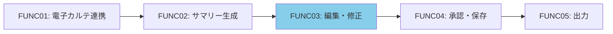
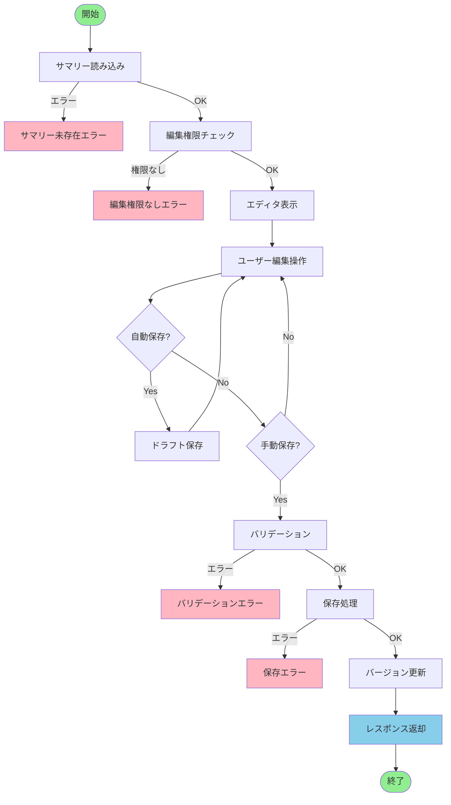
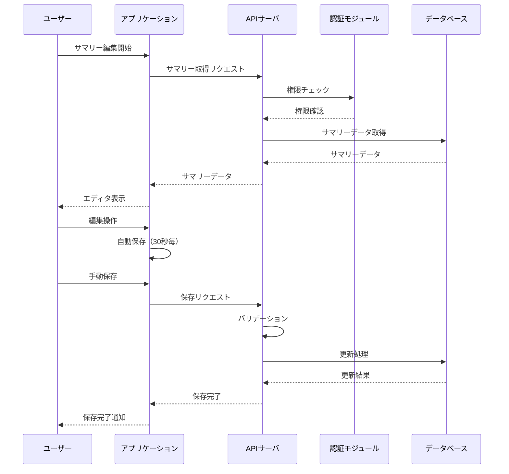
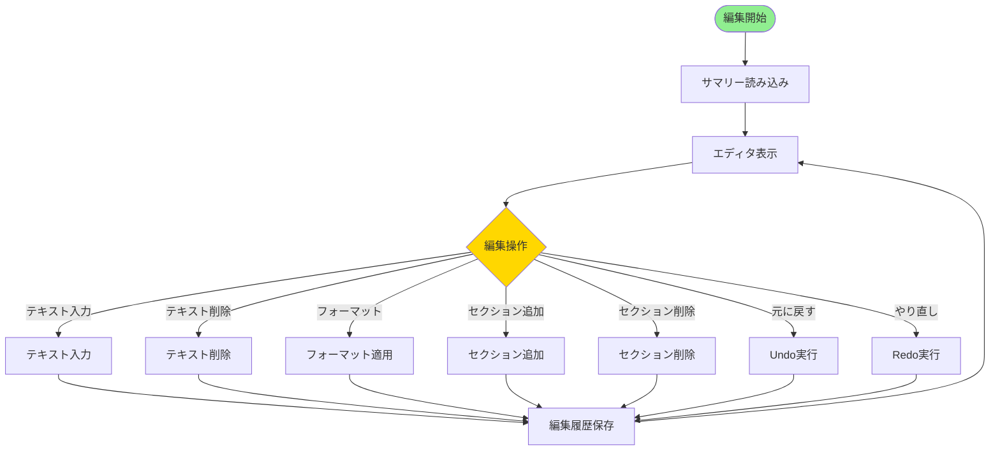
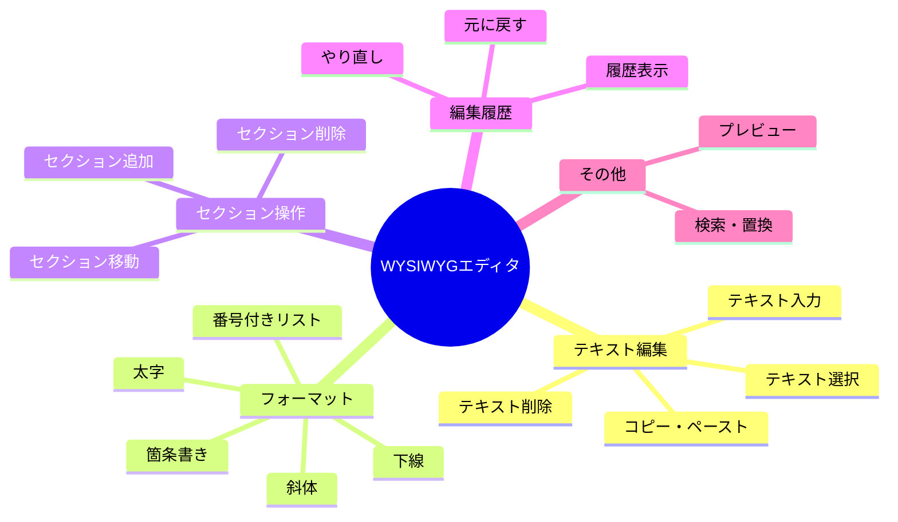
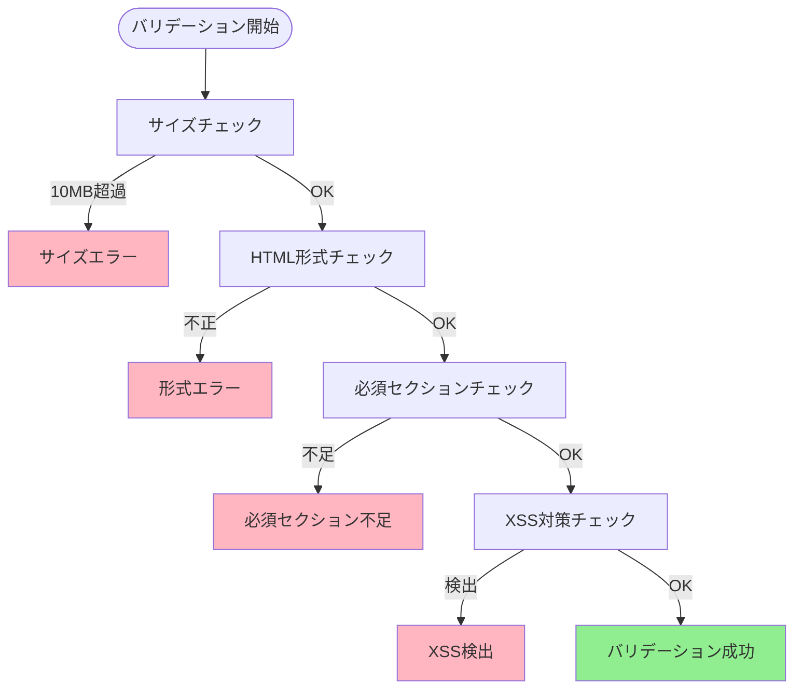
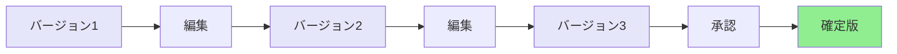
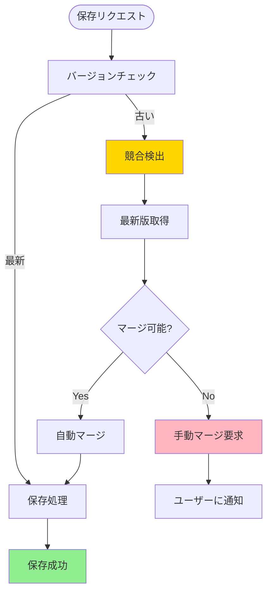
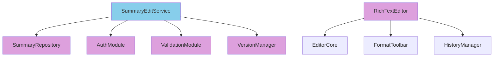
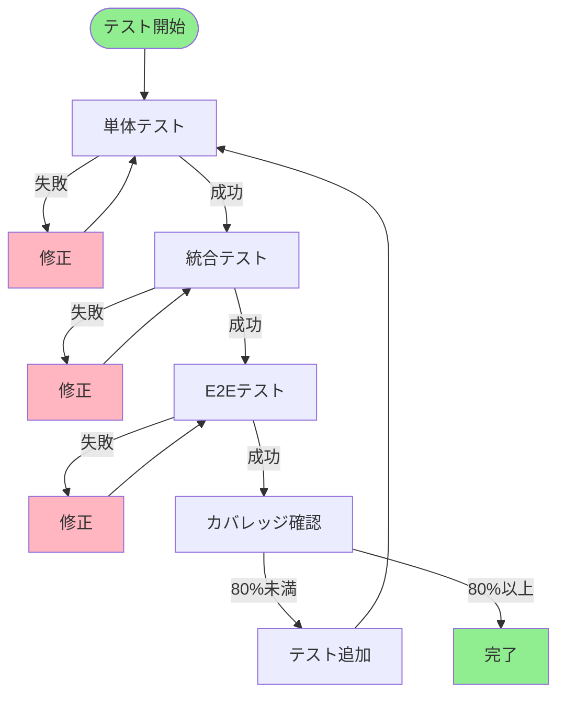

# 機能詳細設計書 - FUNC03: 編集・修正機能

## 1. ドキュメント情報

| 項目 | 内容 |
|---|---|
| 機能ID | FUNC03 |
| 機能名 | 編集・修正機能 |
| 対応要件ID | REQ03 |
| バージョン | 1.0 |
| 作成日 | 2025年01月15日 |
| 関連ドキュメント | 基本設計書（docs/design/basic_design.md） |

## 2. 機能概要

自動生成されたサマリーの内容を、医師が画面上で確認し、自由にテキストの追記、修正、削除を行えるWYSIWYGエディタ機能。

### 2.1 機能の位置づけ

## 3. 処理フロー

### 3.1 全体フロー

### 3.2 シーケンス図

### 3.3 編集操作フロー

## 4. 入力仕様

### 4.1 APIエンドポイント（取得）

- **エンドポイント**: `GET /api/v1/summaries/{summaryId}`
- **メソッド**: GET
- **認証**: Bearer Token必須

### 4.2 APIエンドポイント（更新）

- **エンドポイント**: `PUT /api/v1/summaries/{summaryId}`
- **メソッド**: PUT
- **認証**: Bearer Token必須

### 4.3 リクエストパラメータ（取得）

| パラメータ名 | 型 | 位置 | 必須 | 説明 | 制約条件 |
|---|---|---|---|---|---|
| summaryId | String | Path | 必須 | サマリーID | 20文字以内 |

### 4.4 リクエストパラメータ（更新）

| パラメータ名 | 型 | 位置 | 必須 | 説明 | 制約条件 |
|---|---|---|---|---|---|
| summaryId | String | Path | 必須 | サマリーID | 20文字以内 |
| content | String | Body | 必須 | HTML形式の編集内容 | 最大10MB |

## 5. 出力仕様

### 5.1 取得レスポンス

**HTTPステータス**: 200 OK

**レスポンス項目**:

| 項目名 | データ型 | 説明 |
|---|---|---|
| summaryId | String | サマリーID |
| patientId | String | 患者ID |
| admissionId | String | 入院ID |
| status | String | ステータス |
| content | String | HTML形式のサマリー内容 |
| version | Integer | バージョン番号 |
| createdBy | String | 作成者 |
| createdAt | DateTime | 作成日時 |
| updatedAt | DateTime | 更新日時 |

### 5.2 更新レスポンス

**HTTPステータス**: 200 OK

**レスポンス項目**:

| 項目名 | データ型 | 説明 |
|---|---|---|
| summaryId | String | サマリーID |
| version | Integer | 更新後のバージョン番号 |
| updatedAt | DateTime | 更新日時 |

## 6. エディタ機能

### 6.1 エディタ機能一覧

### 6.2 エディタ機能詳細

| 機能名 | 説明 | 実装方法 |
|---|---|---|
| テキスト入力 | 自由なテキスト入力 | Rich Text Editor |
| テキスト編集 | 既存テキストの修正 | Rich Text Editor |
| テキスト削除 | 不要なテキストの削除 | Rich Text Editor |
| フォーマット | 太字、斜体、箇条書き | Rich Text Editor |
| セクション追加 | 新しいセクションの追加 | カスタム機能 |
| セクション削除 | 不要なセクションの削除 | カスタム機能 |
| 元に戻す/やり直し | 操作の取り消し・再実行 | Undo/Redo機能 |
| プレビュー | 印刷時の見た目確認 | プレビュー機能 |
| 自動保存 | 30秒毎の自動保存 | タイマー機能 |

### 6.3 データ保存形式

| 項目 | 仕様 |
|---|---|
| 保存形式 | HTML形式 |
| エンコーディング | UTF-8 |
| バージョン管理 | 編集履歴を保持 |
| 自動保存間隔 | 30秒 |

## 7. バリデーション

### 7.1 バリデーション項目

### 7.2 バリデーションルール

| 項目 | ルール | エラーメッセージ |
|---|---|---|
| コンテンツサイズ | 最大10MB | "コンテンツサイズが上限を超えています" |
| HTML形式 | 有効なHTML形式 | "無効なHTML形式です" |
| 必須セクション | 患者基本情報、病名、治療経過が含まれる | "必須セクションが不足しています" |
| XSS対策 | スクリプトタグが含まれていない | "不正なコンテンツが検出されました" |

## 8. バージョン管理

### 8.1 バージョン管理フロー

### 8.2 バージョン情報

| 項目 | 説明 |
|---|---|
| バージョン番号 | 整数、1から開始、保存のたびにインクリメント |
| 編集履歴 | 各バージョンの編集内容を保持 |
| 差分管理 | 前バージョンとの差分を記録 |

## 9. エラーハンドリング

### 9.1 エラー一覧

| HTTPステータス | エラーコード | 説明 | 処理内容 |
|---|---|---|---|
| 404 | SUMMARY_NOT_FOUND | サマリー未存在 | エラーメッセージを返却 |
| 403 | EDIT_PERMISSION_DENIED | 編集権限なし | エラーメッセージを返却 |
| 400 | VALIDATION_ERROR | バリデーションエラー | エラー箇所を特定してメッセージを返却 |
| 500 | SAVE_ERROR | 保存エラー | エラーログを記録、エラーメッセージを返却 |
| 409 | VERSION_CONFLICT | バージョン競合 | 最新バージョンを取得して再編集を促す |

### 9.2 バージョン競合処理

## 10. モジュール設計

### 10.1 モジュール構成図

### 10.2 モジュール責務

| モジュール名 | 責務 | 主要処理 |
|---|---|---|
| SummaryEditService | 編集処理のオーケストレーション | 全体フローの制御、各モジュールの呼び出し |
| SummaryRepository | データベース操作 | サマリーの取得、更新 |
| AuthModule | 認証・認可処理 | 編集権限チェック |
| ValidationModule | バリデーション処理 | 入力値の検証 |
| VersionManager | バージョン管理 | バージョン番号管理、編集履歴管理 |
| RichTextEditor | エディタ機能 | WYSIWYGエディタの提供 |
| HistoryManager | 編集履歴管理 | Undo/Redo機能 |

## 11. テスト設計（TDD）

### 11.1 テスト実行フロー

### 11.2 テストケース一覧

#### TC-FUNC03-001: 正常系 - サマリー取得成功

**Given**: 
- 有効なサマリーID（S001）が指定されている
- 認証トークンが有効である
- 編集権限がある

**When**: 
- サマリー取得APIを呼び出す

**Then**: 
- HTTPステータス200が返却される
- サマリー内容が返却される
- バージョン番号が返却される

#### TC-FUNC03-002: 異常系 - サマリー未存在

**Given**: 
- 存在しないサマリーID（S999）が指定されている

**When**: 
- サマリー取得APIを呼び出す

**Then**: 
- HTTPステータス404が返却される
- エラーコード `SUMMARY_NOT_FOUND` が返却される

#### TC-FUNC03-003: 異常系 - 編集権限なし

**Given**: 
- 有効なサマリーIDが指定されている
- 編集権限がないユーザー

**When**: 
- サマリー取得APIを呼び出す

**Then**: 
- HTTPステータス403が返却される
- エラーコード `EDIT_PERMISSION_DENIED` が返却される

#### TC-FUNC03-004: 正常系 - サマリー更新成功

**Given**: 
- 有効なサマリーIDが指定されている
- 有効な編集内容が指定されている
- 編集権限がある

**When**: 
- サマリー更新APIを呼び出す

**Then**: 
- HTTPステータス200が返却される
- バージョン番号がインクリメントされる
- 更新日時が記録される

#### TC-FUNC03-005: 異常系 - バリデーションエラー（サイズ超過）

**Given**: 
- 有効なサマリーIDが指定されている
- 10MBを超える編集内容が指定されている

**When**: 
- サマリー更新APIを呼び出す

**Then**: 
- HTTPステータス400が返却される
- エラーコード `VALIDATION_ERROR` が返却される
- エラーメッセージにサイズ超過が含まれる

#### TC-FUNC03-006: 異常系 - バリデーションエラー（必須セクション不足）

**Given**: 
- 有効なサマリーIDが指定されている
- 必須セクションが欠落している編集内容が指定されている

**When**: 
- サマリー更新APIを呼び出す

**Then**: 
- HTTPステータス400が返却される
- エラーコード `VALIDATION_ERROR` が返却される
- 不足しているセクションがエラーメッセージに含まれる

#### TC-FUNC03-007: 正常系 - 自動保存

**Given**: 
- エディタが表示されている
- 編集操作が行われている

**When**: 
- 30秒経過する

**Then**: 
- 自動的にドラフト保存が実行される
- ユーザーに通知が表示される

#### TC-FUNC03-008: 正常系 - Undo/Redo機能

**Given**: 
- エディタが表示されている
- 編集操作が行われている

**When**: 
- Undo操作を実行する

**Then**: 
- 直前の編集操作が取り消される
- Redo操作で元に戻せる

#### TC-FUNC03-009: 正常系 - バージョン管理

**Given**: 
- サマリーが存在する
- バージョン1で保存されている

**When**: 
- 編集して保存する

**Then**: 
- バージョン2で保存される
- 編集履歴が記録される

#### TC-FUNC03-010: 異常系 - バージョン競合

**Given**: 
- サマリーが存在する
- 複数のユーザーが同時に編集している
- 古いバージョンで保存を試みる

**When**: 
- サマリー更新APIを呼び出す

**Then**: 
- HTTPステータス409が返却される
- エラーコード `VERSION_CONFLICT` が返却される
- 最新バージョンが返却される

#### TC-FUNC03-011: 正常系 - セクション追加

**Given**: 
- エディタが表示されている

**When**: 
- セクション追加操作を実行する

**Then**: 
- 新しいセクションが追加される
- 編集履歴に記録される

#### TC-FUNC03-012: 正常系 - セクション削除

**Given**: 
- エディタが表示されている
- セクションが存在する

**When**: 
- セクション削除操作を実行する

**Then**: 
- セクションが削除される
- 編集履歴に記録される

## 12. パフォーマンス要件

| 項目 | 目標値 | 測定方法 |
|---|---|---|
| サマリー取得時間 | 1秒以内 | リクエスト受信からレスポンス返却まで |
| 保存処理時間 | 2秒以内 | 保存リクエストから完了通知まで |
| 自動保存間隔 | 30秒 | タイマー設定 |

## 13. セキュリティ要件

| 項目 | 要件 |
|---|---|
| 認証 | Bearer Token必須 |
| 認可 | 編集権限チェック |
| XSS対策 | スクリプトタグの除去、サニタイズ |
| 通信暗号化 | TLS 1.3以上 |
| ログ記録 | すべての編集操作を監査ログに記録 |

## 14. 更新履歴

| バージョン | 更新日 | 更新内容 | 更新者 |
|---|---|---|---|
| 1.0 | 2025年01月15日 | 初版作成 | {作成者名} |

