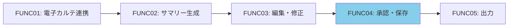
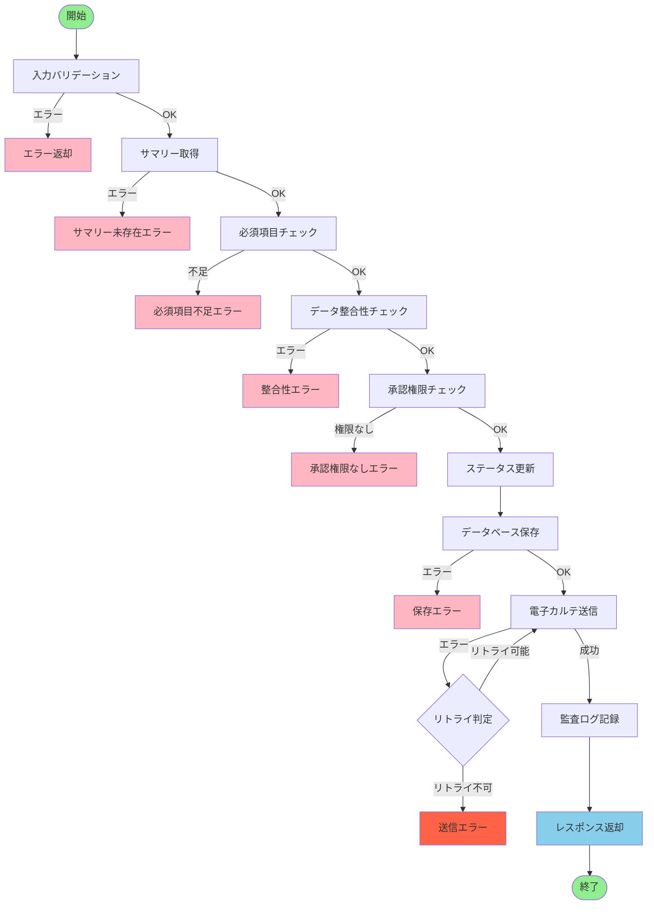
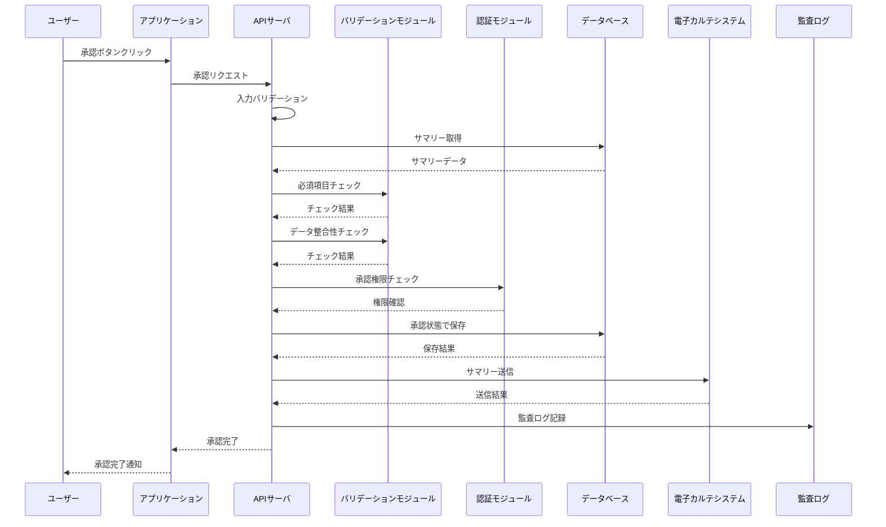
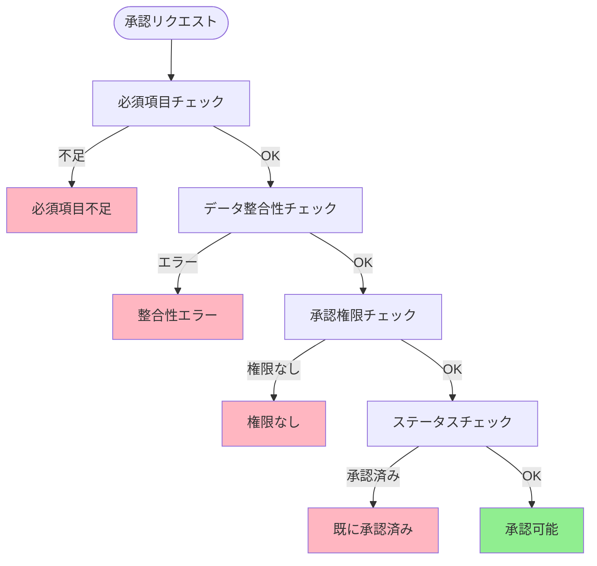
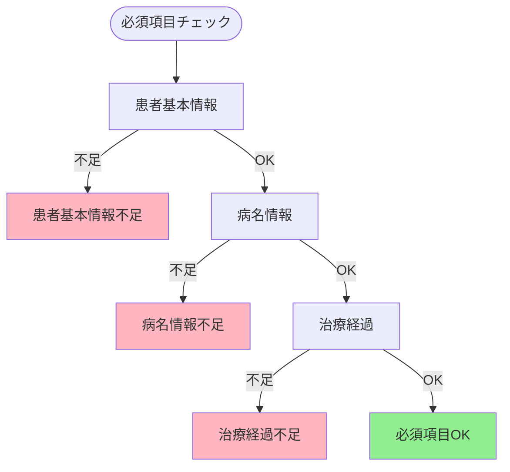
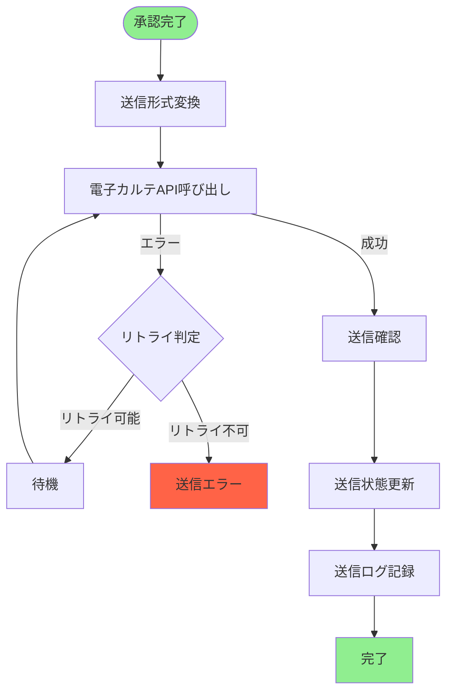
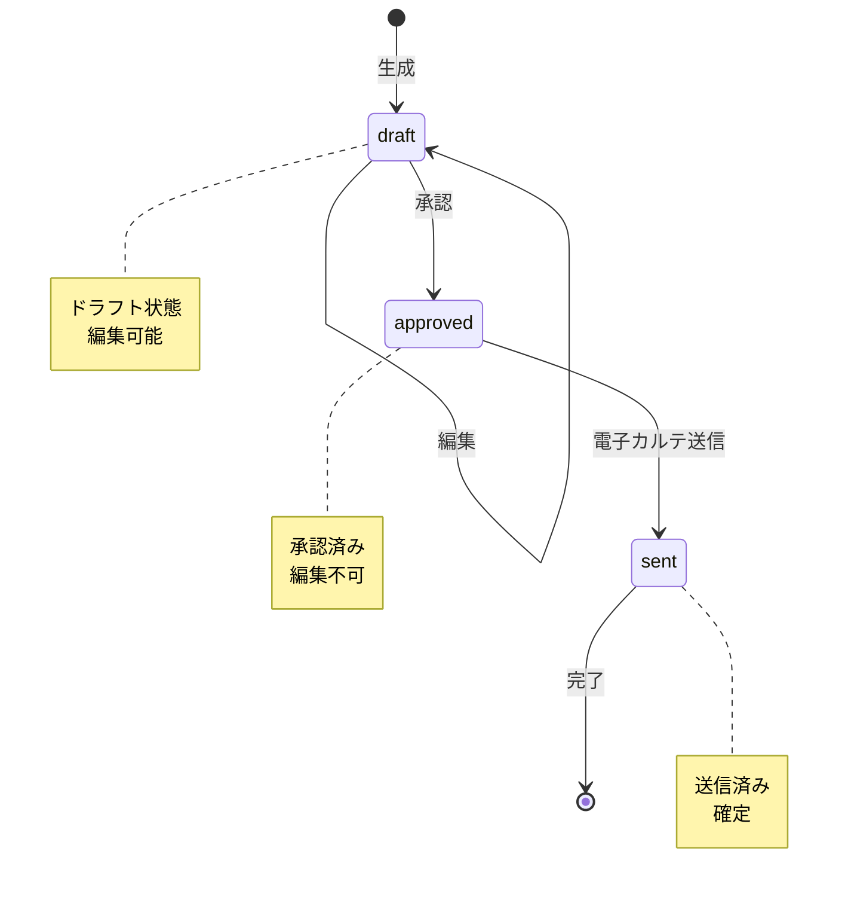
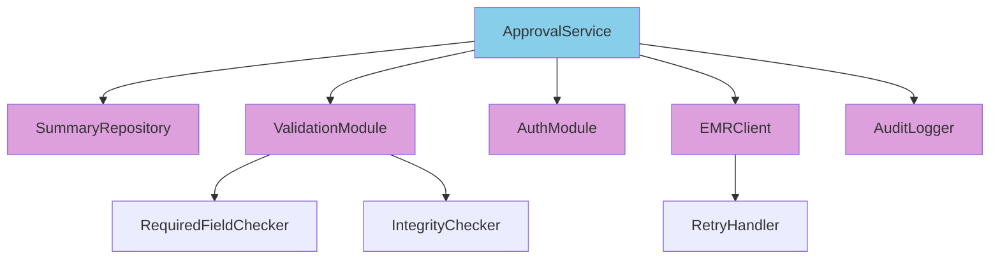
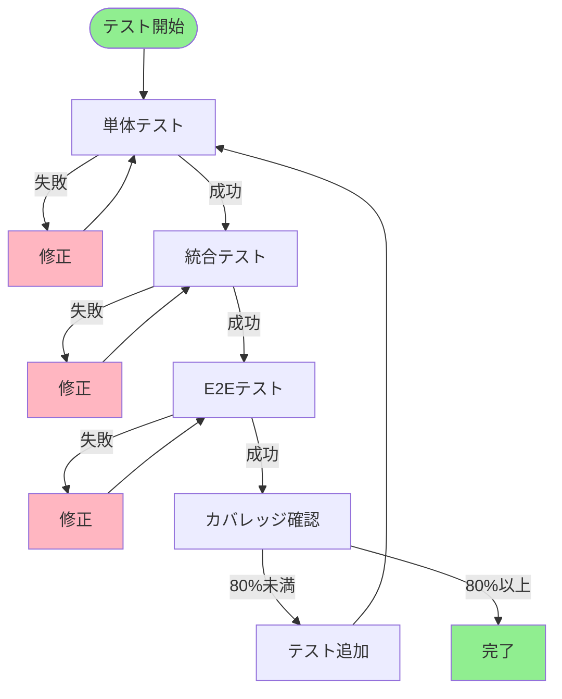

# 機能詳細設計書 - FUNC04: 承認・保存機能

## 1. ドキュメント情報

| 項目 | 内容 |
|---|---|
| 機能ID | FUNC04 |
| 機能名 | 承認・保存機能 |
| 対応要件ID | REQ04 |
| バージョン | 1.0 |
| 作成日 | 2025年01月15日 |
| 関連ドキュメント | 基本設計書（docs/design/basic_design.md） |

## 2. 機能概要

医師が内容を確認・修正後、承認操作を行うことで、完成したサマリーを正式な文書としてシステム内に保存し、電子カルテシステムに反映させる機能。

### 2.1 機能の位置づけ

## 3. 処理フロー

### 3.1 全体フロー

### 3.2 シーケンス図

### 3.3 承認前チェックフロー

## 4. 入力仕様

### 4.1 APIエンドポイント

- **エンドポイント**: `POST /api/v1/summaries/{summaryId}/approve`
- **メソッド**: POST
- **認証**: Bearer Token必須

### 4.2 リクエストパラメータ

| パラメータ名 | 型 | 位置 | 必須 | 説明 | 制約条件 |
|---|---|---|---|---|---|
| summaryId | String | Path | 必須 | 承認対象のサマリーID | 20文字以内 |

## 5. 出力仕様

### 5.1 成功レスポンス

**HTTPステータス**: 200 OK

**レスポンス項目**:

| 項目名 | データ型 | 説明 |
|---|---|---|
| summaryId | String | サマリーID |
| status | String | ステータス（approved） |
| approvedBy | String | 承認者のユーザーID |
| approvedAt | DateTime | 承認日時 |

## 6. 承認前チェック

### 6.1 必須項目チェック

### 6.2 必須項目一覧

| 項目 | チェック内容 |
|---|---|
| 患者基本情報 | 氏名、生年月日、性別が記載されていること |
| 病名情報 | 主病名が記載されていること |
| 治療経過 | 治療内容が記載されていること |

### 6.3 データ整合性チェック

| チェック項目 | チェック内容 |
|---|---|
| 日付整合性 | 入院日 < 退院日 |
| 病名コード | ICD-10コードが有効であること |
| 処方情報 | 薬剤名、用量、頻度が記載されていること |

## 7. 電子カルテ送信

### 7.1 送信フロー

### 7.2 送信データ形式

| 項目 | 説明 |
|---|---|
| 送信形式 | 電子カルテシステムが要求する形式 |
| データ変換 | システム内部形式から送信形式へ変換 |
| 送信タイミング | 承認完了後、即座に送信 |

### 7.3 リトライ処理

| 項目 | 仕様 |
|---|---|
| リトライ回数 | 最大3回 |
| リトライ間隔 | 1秒、2秒、4秒（指数バックオフ） |
| リトライ条件 | ネットワークエラー、タイムアウトエラー |

## 8. ステータス管理

### 8.1 ステータス遷移図

### 8.2 ステータス一覧

| ステータス | 説明 | 編集可能 | 承認可能 |
|---|---|---|---|
| draft | ドラフト | 可 | 可 |
| approved | 承認済み | 不可 | 不可 |
| sent | 電子カルテ送信済み | 不可 | 不可 |

## 9. エラーハンドリング

### 9.1 エラー一覧

| HTTPステータス | エラーコード | 説明 | 処理内容 |
|---|---|---|---|
| 400 | INVALID_REQUEST | リクエストが不正 | エラーメッセージを返却 |
| 404 | SUMMARY_NOT_FOUND | サマリー未存在 | エラーメッセージを返却 |
| 400 | REQUIRED_FIELD_MISSING | 必須項目不足 | 不足項目を特定してメッセージを返却 |
| 500 | DATA_INTEGRITY_ERROR | データ整合性エラー | エラーメッセージを返却 |
| 403 | APPROVAL_PERMISSION_DENIED | 承認権限なし | エラーメッセージを返却 |
| 409 | ALREADY_APPROVED | 既に承認済み | エラーメッセージを返却 |
| 500 | SAVE_ERROR | 保存エラー | エラーログを記録、エラーメッセージを返却 |
| 503 | EMR_SEND_ERROR | 電子カルテ送信エラー | エラーログを記録、リトライ処理を実施 |

## 10. モジュール設計

### 10.1 モジュール構成図

### 10.2 モジュール責務

| モジュール名 | 責務 | 主要処理 |
|---|---|---|
| ApprovalService | 承認処理のオーケストレーション | 全体フローの制御、各モジュールの呼び出し |
| SummaryRepository | データベース操作 | サマリーの取得、更新 |
| ValidationModule | バリデーション処理 | 必須項目チェック、データ整合性チェック |
| AuthModule | 認証・認可処理 | 承認権限チェック |
| EMRClient | 電子カルテ連携 | サマリー送信、リトライ処理 |
| AuditLogger | 監査ログ記録 | 承認操作のログ記録 |

## 11. テスト設計（TDD）

### 11.1 テスト実行フロー

### 11.2 テストケース一覧

#### TC-FUNC04-001: 正常系 - 承認成功

**Given**: 
- 有効なサマリーID（S001）が指定されている
- 必須項目がすべて記載されている
- データ整合性が取れている
- 承認権限がある

**When**: 
- 承認APIを呼び出す

**Then**: 
- HTTPステータス200が返却される
- ステータスが "approved" に更新される
- 承認者、承認日時が記録される
- 電子カルテシステムに送信される
- 監査ログが記録される

#### TC-FUNC04-002: 異常系 - サマリー未存在

**Given**: 
- 存在しないサマリーID（S999）が指定されている

**When**: 
- 承認APIを呼び出す

**Then**: 
- HTTPステータス404が返却される
- エラーコード `SUMMARY_NOT_FOUND` が返却される

#### TC-FUNC04-003: 異常系 - 必須項目不足

**Given**: 
- 有効なサマリーIDが指定されている
- 必須項目（病名）が欠落している

**When**: 
- 承認APIを呼び出す

**Then**: 
- HTTPステータス400が返却される
- エラーコード `REQUIRED_FIELD_MISSING` が返却される
- 不足している項目がエラーメッセージに含まれる

#### TC-FUNC04-004: 異常系 - データ整合性エラー

**Given**: 
- 有効なサマリーIDが指定されている
- 入院日が退院日より後になっている

**When**: 
- 承認APIを呼び出す

**Then**: 
- HTTPステータス500が返却される
- エラーコード `DATA_INTEGRITY_ERROR` が返却される

#### TC-FUNC04-005: 異常系 - 承認権限なし

**Given**: 
- 有効なサマリーIDが指定されている
- 承認権限がないユーザー

**When**: 
- 承認APIを呼び出す

**Then**: 
- HTTPステータス403が返却される
- エラーコード `APPROVAL_PERMISSION_DENIED` が返却される

#### TC-FUNC04-006: 異常系 - 既に承認済み

**Given**: 
- 有効なサマリーIDが指定されている
- サマリーが既に承認済みである

**When**: 
- 承認APIを呼び出す

**Then**: 
- HTTPステータス409が返却される
- エラーコード `ALREADY_APPROVED` が返却される

#### TC-FUNC04-007: 正常系 - 電子カルテ送信成功

**Given**: 
- サマリーが承認された
- 電子カルテシステムが正常に動作している

**When**: 
- 電子カルテ送信処理を実行する

**Then**: 
- 電子カルテシステムに正常に送信される
- ステータスが "sent" に更新される
- 送信ログが記録される

#### TC-FUNC04-008: 異常系 - 電子カルテ送信エラー（リトライ成功）

**Given**: 
- サマリーが承認された
- 電子カルテシステムが一時的にエラーを返す

**When**: 
- 電子カルテ送信処理を実行する

**Then**: 
- リトライ処理が実行される
- リトライ後に送信が成功する
- ステータスが "sent" に更新される

#### TC-FUNC04-009: 異常系 - 電子カルテ送信エラー（リトライ失敗）

**Given**: 
- サマリーが承認された
- 電子カルテシステムが継続的にエラーを返す

**When**: 
- 電子カルテ送信処理を実行する

**Then**: 
- リトライ処理が最大3回実行される
- リトライ後も失敗した場合、HTTPステータス503が返却される
- エラーコード `EMR_SEND_ERROR` が返却される
- エラーログが記録される

#### TC-FUNC04-010: 正常系 - 監査ログ記録

**Given**: 
- サマリーが承認された

**When**: 
- 承認処理が完了する

**Then**: 
- 監査ログに承認操作が記録される
- 承認者、承認日時、サマリーIDが記録される

#### TC-FUNC04-011: 正常系 - ステータス遷移

**Given**: 
- サマリーがドラフト状態である

**When**: 
- 承認処理を実行する

**Then**: 
- ステータスが "draft" → "approved" → "sent" に遷移する

#### TC-FUNC04-012: 正常系 - 必須項目チェック（全項目OK）

**Given**: 
- サマリーに必須項目がすべて記載されている

**When**: 
- 必須項目チェックを実行する

**Then**: 
- チェックが成功する
- エラーが返却されない

## 12. パフォーマンス要件

| 項目 | 目標値 | 測定方法 |
|---|---|---|
| 承認処理時間 | 3秒以内 | リクエスト受信からレスポンス返却まで |
| 電子カルテ送信時間 | 2秒以内 | 送信開始から完了まで |
| リトライ処理時間 | 最大7秒 | 3回のリトライを含む |

## 13. セキュリティ要件

| 項目 | 要件 |
|---|---|
| 認証 | Bearer Token必須 |
| 認可 | 承認権限チェック |
| 監査ログ | すべての承認操作を記録 |
| 通信暗号化 | TLS 1.3以上 |
| データ整合性 | 承認前の整合性チェック |

## 14. 更新履歴

| バージョン | 更新日 | 更新内容 | 更新者 |
|---|---|---|---|
| 1.0 | 2025年01月15日 | 初版作成 | {作成者名} |

