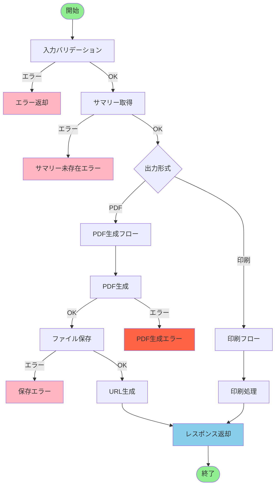
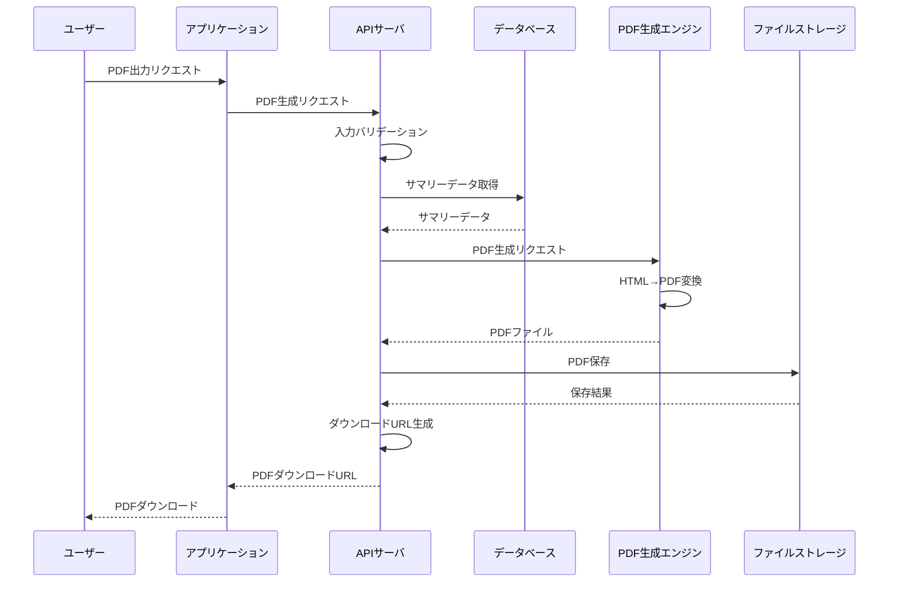
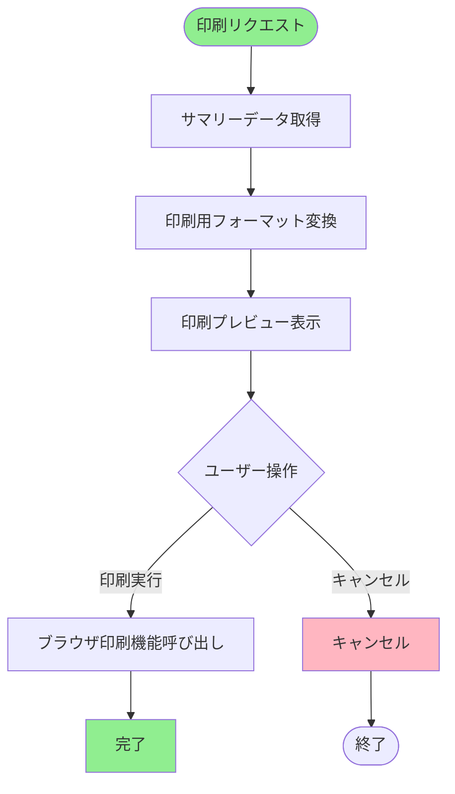
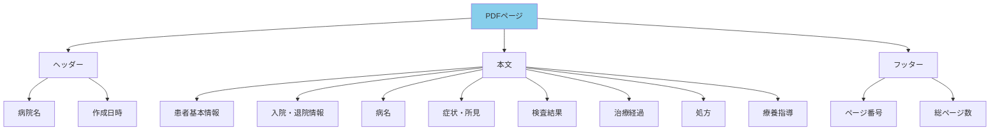
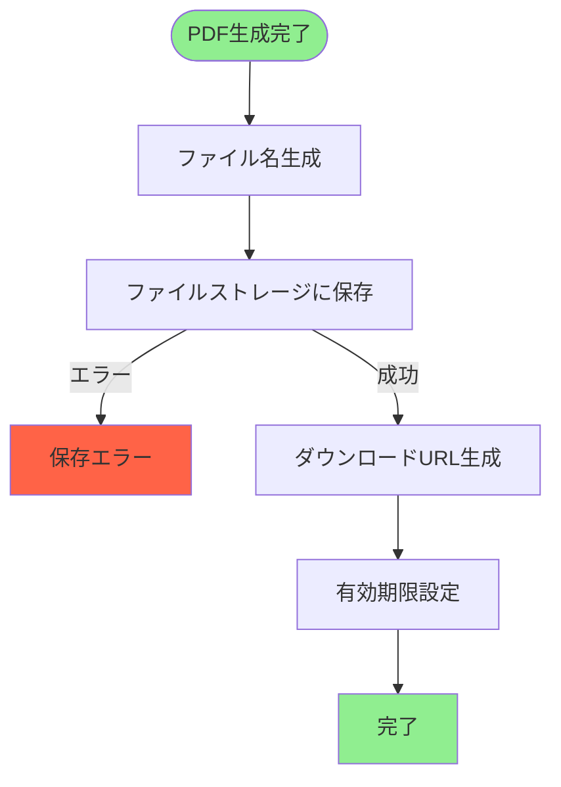
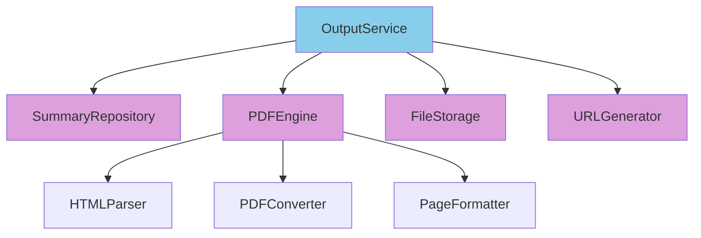
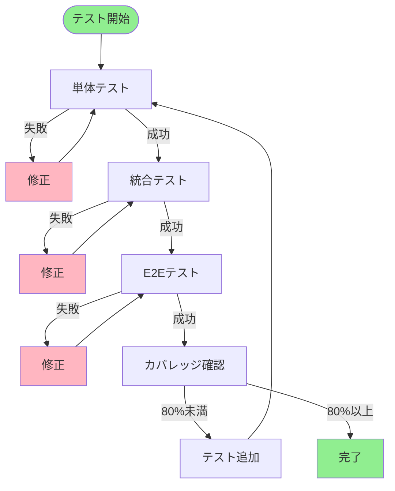

# 機能詳細設計書 - FUNC05: 出力機能

## 1. ドキュメント情報

| 項目 | 内容 |
|---|---|
| 機能ID | FUNC05 |
| 機能名 | 出力機能 |
| 対応要件ID | REQ05 |
| バージョン | 1.0 |
| 作成日 | 2025年01月15日 |
| 関連ドキュメント | 基本設計書（docs/design/basic_design.md） |

## 2. 機能概要

完成した退院時サマリーを、指定されたフォーマットのPDFファイルとして出力、またはプリンターで印刷する機能。

### 2.1 機能の位置づけ

## 3. 処理フロー

### 3.1 全体フロー

### 3.2 PDF生成シーケンス図

### 3.3 印刷フロー

## 4. 入力仕様

### 4.1 APIエンドポイント

- **エンドポイント**: `POST /api/v1/summaries/{summaryId}/pdf`
- **メソッド**: POST
- **認証**: Bearer Token必須

### 4.2 リクエストパラメータ

| パラメータ名 | 型 | 位置 | 必須 | 説明 | 制約条件 |
|---|---|---|---|---|---|
| summaryId | String | Path | 必須 | 出力対象のサマリーID | 20文字以内 |
| outputFormat | String | Body | 必須 | 出力形式 | "PDF" or "PRINT" |

## 5. 出力仕様

### 5.1 PDF出力レスポンス

**HTTPステータス**: 200 OK

**レスポンス項目**:

| 項目名 | データ型 | 説明 |
|---|---|---|
| summaryId | String | サマリーID |
| pdfUrl | String | PDFファイルのダウンロードURL |
| expiresAt | DateTime | URL有効期限 |
| fileSize | Integer | ファイルサイズ（バイト） |

### 5.2 印刷レスポンス

**HTTPステータス**: 200 OK

**レスポンス項目**:

| 項目名 | データ型 | 説明 |
|---|---|---|
| summaryId | String | サマリーID |
| printData | String | 印刷用HTMLデータ |

## 6. PDF仕様

### 6.1 PDF形式

| 項目 | 仕様 |
|---|---|
| フォーマット | PDF/A-1b（長期保存形式） |
| 用紙サイズ | A4 |
| 向き | 縦向き |
| 余白 | 上下左右各20mm |

### 6.2 フォント仕様

| 項目 | 仕様 |
|---|---|
| 日本語フォント | メイリオ |
| 英語フォント | Arial |
| フォントサイズ | 本文10pt、見出し12pt |

### 6.3 ページ構成

### 6.4 PDF生成フロー

## 7. ファイル保存

### 7.1 保存フロー

### 7.2 ファイル名規則

| 項目 | 規則 |
|---|---|
| ファイル名形式 | summary_{summaryId}_{timestamp}.pdf |
| 例 | summary_S001_20240115100000.pdf |

### 7.3 URL有効期限

| 項目 | 仕様 |
|---|---|
| 有効期限 | 生成から24時間 |
| 期限切れ後 | 再生成が必要 |

## 8. エラーハンドリング

### 8.1 エラー一覧

| HTTPステータス | エラーコード | 説明 | 処理内容 |
|---|---|---|---|
| 400 | INVALID_REQUEST | リクエストが不正 | エラーメッセージを返却 |
| 404 | SUMMARY_NOT_FOUND | サマリー未存在 | エラーメッセージを返却 |
| 500 | PDF_GENERATION_ERROR | PDF生成エラー | エラーログを記録、エラーメッセージを返却 |
| 500 | FILE_SAVE_ERROR | ファイル保存エラー | エラーログを記録、エラーメッセージを返却 |
| 500 | STORAGE_FULL | ストレージ容量不足 | エラーログを記録、管理者に通知 |

## 9. モジュール設計

### 9.1 モジュール構成図

### 9.2 モジュール責務

| モジュール名 | 責務 | 主要処理 |
|---|---|---|
| OutputService | 出力処理のオーケストレーション | 全体フローの制御、各モジュールの呼び出し |
| SummaryRepository | データベース操作 | サマリーの取得 |
| PDFEngine | PDF生成処理 | HTML→PDF変換、ページ分割、ヘッダー・フッター追加 |
| FileStorage | ファイル保存 | PDFファイルの保存、取得 |
| URLGenerator | URL生成 | ダウンロードURLの生成、有効期限管理 |

## 10. テスト設計（TDD）

### 10.1 テスト実行フロー

### 10.2 テストケース一覧

#### TC-FUNC05-001: 正常系 - PDF生成成功

**Given**: 
- 有効なサマリーID（S001）が指定されている
- 出力形式が "PDF" である
- PDF生成エンジンが正常に動作している

**When**: 
- PDF出力APIを呼び出す

**Then**: 
- HTTPステータス200が返却される
- PDFファイルが生成される
- ダウンロードURLが返却される
- ファイルストレージに保存される

#### TC-FUNC05-002: 異常系 - サマリー未存在

**Given**: 
- 存在しないサマリーID（S999）が指定されている

**When**: 
- PDF出力APIを呼び出す

**Then**: 
- HTTPステータス404が返却される
- エラーコード `SUMMARY_NOT_FOUND` が返却される

#### TC-FUNC05-003: 異常系 - PDF生成エラー

**Given**: 
- 有効なサマリーIDが指定されている
- PDF生成エンジンがエラーを返す

**When**: 
- PDF出力APIを呼び出す

**Then**: 
- HTTPステータス500が返却される
- エラーコード `PDF_GENERATION_ERROR` が返却される
- エラーログが記録される

#### TC-FUNC05-004: 異常系 - ファイル保存エラー

**Given**: 
- 有効なサマリーIDが指定されている
- PDFファイルが生成された
- ファイルストレージがエラーを返す

**When**: 
- PDF出力APIを呼び出す

**Then**: 
- HTTPステータス500が返却される
- エラーコード `FILE_SAVE_ERROR` が返却される
- エラーログが記録される

#### TC-FUNC05-005: 正常系 - 印刷処理

**Given**: 
- 有効なサマリーIDが指定されている
- 出力形式が "PRINT" である

**When**: 
- 印刷出力APIを呼び出す

**Then**: 
- HTTPステータス200が返却される
- 印刷用HTMLデータが返却される
- ブラウザの印刷機能が呼び出される

#### TC-FUNC05-006: 正常系 - PDF形式確認

**Given**: 
- PDFファイルが生成された

**When**: 
- PDFファイルの形式を確認する

**Then**: 
- PDF/A-1b形式である
- A4サイズである
- 縦向きである

#### TC-FUNC05-007: 正常系 - ファイル名生成

**Given**: 
- サマリーID（S001）が指定されている
- タイムスタンプが記録されている

**When**: 
- ファイル名を生成する

**Then**: 
- ファイル名が "summary_S001_{timestamp}.pdf" 形式で生成される

#### TC-FUNC05-008: 正常系 - URL有効期限設定

**Given**: 
- PDFファイルが保存された

**When**: 
- ダウンロードURLを生成する

**Then**: 
- URLが生成される
- 有効期限が24時間後に設定される

#### TC-FUNC05-009: 異常系 - URL有効期限切れ

**Given**: 
- ダウンロードURLが生成された
- 24時間以上経過している

**When**: 
- ダウンロードURLにアクセスする

**Then**: 
- HTTPステータス410が返却される
- エラーメッセージが返却される

#### TC-FUNC05-010: 正常系 - ページ分割

**Given**: 
- 長いサマリー内容が存在する

**When**: 
- PDF生成処理を実行する

**Then**: 
- 複数ページに分割される
- 各ページにヘッダー・フッターが追加される
- ページ番号が正しく表示される

#### TC-FUNC05-011: 正常系 - フォント適用

**Given**: 
- サマリー内容が存在する

**When**: 
- PDF生成処理を実行する

**Then**: 
- 日本語はメイリオフォントが適用される
- 英語はArialフォントが適用される
- フォントサイズが正しく設定される

#### TC-FUNC05-012: パフォーマンス - PDF生成時間

**Given**: 
- 有効なサマリーIDが指定されている

**When**: 
- PDF出力APIを呼び出す

**Then**: 
- PDF生成が5秒以内に完了する

## 11. パフォーマンス要件

| 項目 | 目標値 | 測定方法 |
|---|---|---|
| PDF生成時間 | 5秒以内 | PDF生成開始から完了まで |
| ファイル保存時間 | 1秒以内 | ファイル保存開始から完了まで |
| 同時PDF生成数 | 20件 | システム全体の同時生成リクエスト数 |

## 12. セキュリティ要件

| 項目 | 要件 |
|---|---|
| 認証 | Bearer Token必須 |
| 認可 | サマリーへのアクセス権限チェック |
| URL有効期限 | 24時間の有効期限設定 |
| ファイルアクセス | 認証されたユーザーのみアクセス可能 |
| ログ記録 | すべてのPDF生成・ダウンロードを監査ログに記録 |

## 13. 更新履歴

| バージョン | 更新日 | 更新内容 | 更新者 |
|---|---|---|---|
| 1.0 | 2025年01月15日 | 初版作成 | {作成者名} |

