# 基本設計書

## 目次

1. [ドキュメント情報](#1-ドキュメント情報)
2. [要件定義書との対応](#2-要件定義書との対応)
3. [システム概要](#3-システム概要)
4. [システムアーキテクチャ設計](#4-システムアーキテクチャ設計)
5. [機能設計](#5-機能設計)
6. [データベース設計](#6-データベース設計)
7. [画面設計](#7-画面設計)
8. [API設計](#8-api設計)
9. [非機能要件設計](#9-非機能要件設計)
10. [テスト設計](#10-テスト設計)
11. [移行設計](#11-移行設計)
12. [運用・保守設計](#12-運用保守設計)
13. [リスク管理](#13-リスク管理)
14. [更新履歴](#14-更新履歴)
15. [付録](#15-付録)

---

## 1. ドキュメント情報

| 項目 | 内容 |
|---|---|
| プロジェクト名 | 退院時サマリー自動作成システム開発プロジェクト |
| ドキュメント名 | 基本設計書 |
| バージョン | 1.0 |
| 作成日 | 2025年01月15日 |
| 作成者 | {作成者名} |
| 承認者 | {承認者名} |
| 承認日 | {YYYY年MM月DD日} |
| 関連ドキュメント | 要件定義書（docs/req.md） |

## 2. 要件定義書との対応

| 要件ID | 要件名 | 対応設計セクション | 設計完了日 | 備考 |
|---|---|---|---|---|
| REQ01 | 電子カルテ連携機能 | 5.1.1, 6.2, 8.2.1 | | |
| REQ02 | 退院時サマリー自動生成機能 | 5.1.2, 8.2.2 | | |
| REQ03 | 編集・修正機能 | 5.1.3, 7.1.2, 8.2.3, 8.2.4 | | |
| REQ04 | 承認・保存機能 | 5.1.4, 8.2.5 | | |
| REQ05 | 出力機能 | 5.1.5, 8.2.6 | | |
| REQ06 | 患者選択画面 | 7.1.1 | | |
| REQ07 | サマリー編集画面 | 7.1.2 | | |
| REQ08 | パフォーマンス要件 | 9.1 | | |
| REQ09 | セキュリティ要件 | 9.2 | | |
| REQ10 | 可用性要件 | 9.3 | | |
| REQ11 | スケーラビリティ要件 | 4.2 | | |
| REQ12 | 患者基本情報データ取得 | 5.1.1, 6.1.2 | | |
| REQ13 | 入院情報データ取得 | 5.1.1, 6.1.2 | | |
| REQ14 | 病名情報データ取得 | 5.1.1, 6.1.2 | | |
| REQ15 | 検査結果データ取得 | 5.1.1, 6.1.2 | | |
| REQ16 | 治療経過データ取得 | 5.1.1, 6.1.2 | | |
| REQ17 | 看護記録データ取得 | 5.1.1, 6.1.2 | | |
| REQ18 | 退院時処方データ取得 | 5.1.1, 6.1.2 | | |
| REQ19 | 退院後の療養指導データ取得 | 5.1.1, 6.1.2 | | |
| REQ20 | 技術的制約への準拠 | 4.3, 9.2 | | |

## 3. システム概要

### 3.1 システム目的

電子カルテ情報に基づき、退院時サマリーのドラフトを自動生成することで、医師の文書作成業務の負担を軽減し、医療の質の向上に貢献する。

### 3.2 システム範囲

#### 3.2.1 対象範囲

- 退院時サマリーの自動生成機能
- 電子カルテシステムとの連携機能
- サマリーの編集・修正機能
- サマリーの承認・保存機能
- サマリーのPDF出力・印刷機能
- 患者選択画面、サマリー編集画面
- 医師、医療情報管理者を対象ユーザーとする

#### 3.2.2 対象外範囲

- 電子カルテシステム本体の機能
- 患者の診療記録の直接編集機能
- サマリー以外の文書作成機能
- モバイルアプリケーション（初版では対象外）
- 多言語対応（初版では日本語のみ）

#### 3.2.3 システム範囲図

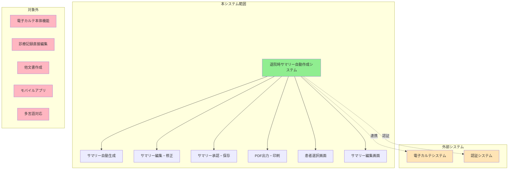
```mermaid
graph TB
    subgraph 本システム範囲
        A[退院時サマリー自動作成システム]
        A1[サマリー自動生成]
        A2[サマリー編集・修正]
        A3[サマリー承認・保存]
        A4[PDF出力・印刷]
        A5[患者選択画面]
        A6[サマリー編集画面]
        A --> A1
        A --> A2
        A --> A3
        A --> A4
        A --> A5
        A --> A6
    end
    
    subgraph 外部システム
        B[電子カルテシステム]
        C[認証システム]
    end
    
    subgraph 対象外
        D[電子カルテ本体機能]
        E[診療記録直接編集]
        F[他文書作成]
        G[モバイルアプリ]
        H[多言語対応]
    end
    
    A -.連携.-> B
    A -.認証.-> C
    
    style A fill:#90EE90
    style B fill:#FFE4B5
    style C fill:#FFE4B5
    style D fill:#FFB6C1
    style E fill:#FFB6C1
    style F fill:#FFB6C1
    style G fill:#FFB6C1
    style H fill:#FFB6C1
```

### 3.3 用語定義

| 用語 | 定義 |
|---|---|
| 退院時サマリー | 患者が退院する際に、入院中の診療内容をまとめた文書 |
| 電子カルテ | 電子化された診療記録システム |
| ICD-10 | 国際疾病分類第10版 |
| WYSIWYG | What You See Is What You Get（見たまま編集できるエディタ） |
| API | Application Programming Interface（アプリケーションプログラミングインターフェース） |
| EMR | Electronic Medical Record（電子医療記録） |

## 4. システムアーキテクチャ設計

### 4.1 システム全体構成図

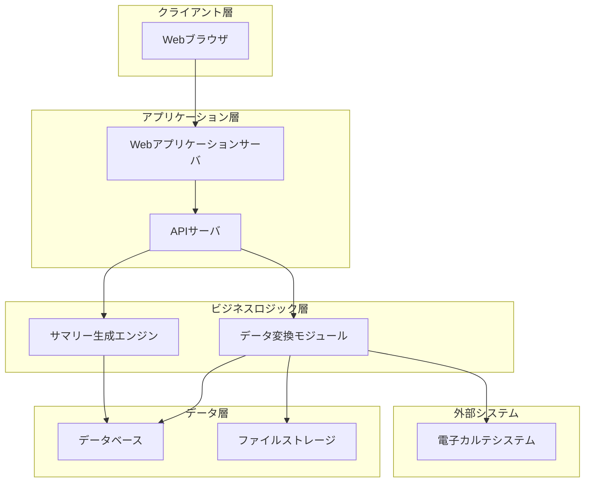
```mermaid
graph TB
    subgraph クライアント層
        A[Webブラウザ]
    end
    subgraph アプリケーション層
        B[Webアプリケーションサーバ]
        C[APIサーバ]
    end
    subgraph ビジネスロジック層
        D[サマリー生成エンジン]
        E[データ変換モジュール]
    end
    subgraph データ層
        F[データベース]
        G[ファイルストレージ]
    end
    subgraph 外部システム
        H[電子カルテシステム]
    end
    
    A --> B
    B --> C
    C --> D
    C --> E
    D --> F
    E --> F
    E --> G
    E --> H
```

### 4.2 システム構成要素

| 構成要素 | 役割 | 技術スタック | スケーラビリティ対応 | 備考 |
|---|---|---|---|---|
| Webアプリケーションサーバ | フロントエンドアプリケーションの配信 | React, Next.js | ロードバランサーによる水平スケール | |
| APIサーバ | RESTful APIの提供 | Node.js, Express | コンテナオーケストレーションによる自動スケール | |
| サマリー生成エンジン | AI/LLMによるサマリー生成 | Python, FastAPI | GPUリソースの動的割り当て | |
| データベース | データの永続化 | PostgreSQL | レプリケーション、シャーディング | |
| ファイルストレージ | PDF等のファイル保存 | オブジェクトストレージ | 分散ストレージ | |

### 4.3 技術スタック

| カテゴリ | 技術 | 選定理由 | バージョン |
|---|---|---|---|
| フロントエンド | React | コンポーネントベースの開発、豊富なエコシステム | 18.x |
| フロントエンド | Next.js | SSR対応、ルーティング機能 | 14.x |
| バックエンド | Node.js | JavaScript統一、非同期処理に優れる | 20.x |
| バックエンド | Express | 軽量で柔軟なWebフレームワーク | 4.x |
| AI/LLM | Python | 機械学習ライブラリが豊富 | 3.11 |
| AI/LLM | FastAPI | 高速なAPIフレームワーク | 0.104 |
| データベース | PostgreSQL | オープンソース、高信頼性 | 15.x |
| インフラ | Docker | コンテナ化による環境統一 | 24.x |
| インフラ | Kubernetes | コンテナオーケストレーション | 1.28 |

### 4.4 ネットワーク構成

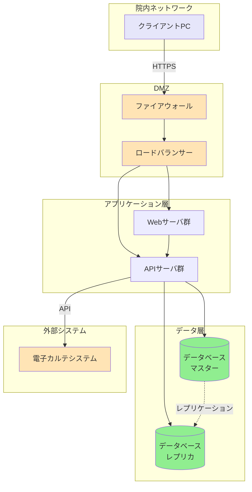
```mermaid
graph TB
    subgraph 院内ネットワーク
        A[クライアントPC]
    end
    
    subgraph DMZ
        B[ファイアウォール]
        C[ロードバランサー]
    end
    
    subgraph アプリケーション層
        D[Webサーバ群]
        E[APIサーバ群]
    end
    
    subgraph データ層
        F[(データベース<br/>マスター)]
        F2[(データベース<br/>レプリカ)]
    end
    
    subgraph 外部システム
        G[電子カルテシステム]
    end
    
    A -->|HTTPS| B
    B --> C
    C --> D
    C --> E
    D --> E
    E --> F
    E --> F2
    E -->|API| G
    F -.レプリケーション.-> F2
    
    style A fill:#E6E6FA
    style B fill:#FFE4B5
    style C fill:#FFE4B5
    style F fill:#90EE90
    style F2 fill:#90EE90
    style G fill:#FFE4B5
```

## 5. 機能設計

### 5.0 業務フロー全体図

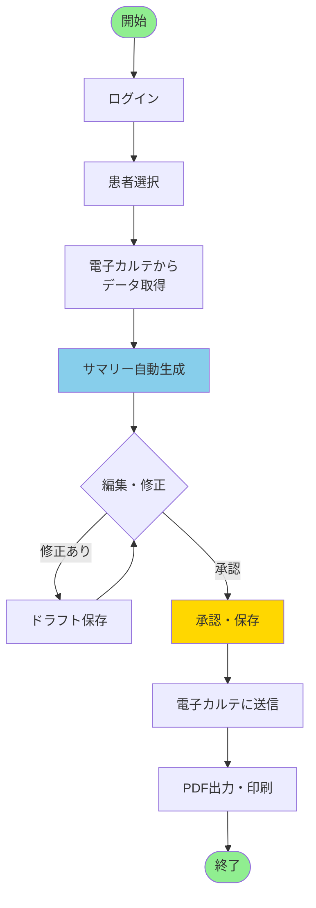
```mermaid
flowchart TD
    Start([開始]) --> Login[ログイン]
    Login --> SelectPatient[患者選択]
    SelectPatient --> GetData[電子カルテから<br/>データ取得]
    GetData --> Generate[サマリー自動生成]
    Generate --> Edit{編集・修正}
    Edit -->|修正あり| Save[ドラフト保存]
    Save --> Edit
    Edit -->|承認| Approve[承認・保存]
    Approve --> SendEMR[電子カルテに送信]
    SendEMR --> Output[PDF出力・印刷]
    Output --> End([終了])
    
    style Start fill:#90EE90
    style End fill:#90EE90
    style Generate fill:#87CEEB
    style Approve fill:#FFD700
```

### 5.1 主要機能設計

#### 5.1.1 電子カルテ連携機能（REQ01, REQ12-REQ19対応）

##### 機能概要

対象患者の電子カルテシステムから、API等を通じて退院時サマリー作成に必要なデータ（患者基本情報、病名、検査結果、治療経過等）を安全に取得する機能。

##### 処理フロー

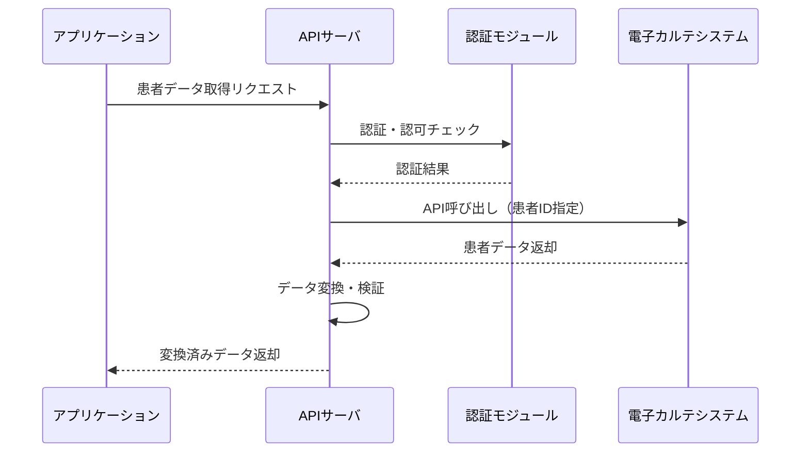
```mermaid
sequenceDiagram
    participant App as アプリケーション
    participant API as APIサーバ
    participant Auth as 認証モジュール
    participant EMR as 電子カルテシステム
    
    App->>API: 患者データ取得リクエスト
    API->>Auth: 認証・認可チェック
    Auth-->>API: 認証結果
    API->>EMR: API呼び出し（患者ID指定）
    EMR-->>API: 患者データ返却
    API->>API: データ変換・検証
    API-->>App: 変換済みデータ返却
```

##### 入力項目

| 項目名 | データ型 | 必須/任意 | 説明 | 制約条件 |
|---|---|---|---|---|
| 患者ID | String | 必須 | 電子カルテシステムの患者ID | 20文字以内 |
| 入院ID | String | 任意 | 特定の入院情報を取得する場合 | 20文字以内 |

##### 出力項目

| 項目名 | データ型 | 説明 |
|---|---|---|
| 患者基本情報 | Object | 氏名、患者ID、生年月日、性別、連絡先 |
| 入院情報 | Object | 入院日、退院日、入院診療科、主治医、病棟 |
| 病名情報 | Array | 主病名、副病名（ICD-10コードを含む） |
| 主要症状・所見 | String | 入院時の主要な症状や身体所見 |
| 検査結果 | Object | 主要な血液検査、画像検査の所見 |
| 治療経過 | String | 入院中の投薬、処置、手術などの治療内容とその経過 |
| 看護記録 | String | 看護師による特記事項 |
| 退院時処方 | Array | 退院時に処方された薬剤情報 |
| 退院後の療養指導 | String | 食事、運動、今後の通院計画などの指導内容 |

##### 処理内容

1. アプリケーションから患者IDを受け取る
2. 認証・認可チェックを実施
3. 電子カルテシステムのAPIを呼び出し、患者データを取得
4. 取得したデータをシステム内部形式に変換
5. データの整合性チェックを実施
6. 変換済みデータをアプリケーションに返却

##### エラーハンドリング

| エラー種別 | エラーコード | 処理内容 |
|---|---|---|
| 認証エラー | AUTH_ERROR | 認証失敗メッセージを返却、ログイン画面へリダイレクト |
| 認可エラー | FORBIDDEN | アクセス権限なしメッセージを返却 |
| 患者ID不正 | INVALID_PATIENT_ID | エラーメッセージを返却 |
| 電子カルテシステムエラー | EMR_SYSTEM_ERROR | エラーログを記録、リトライ処理を実施 |
| データ変換エラー | DATA_CONVERSION_ERROR | エラーログを記録、部分的なデータを返却 |

#### 5.1.2 退院時サマリー自動生成機能（REQ02対応）

##### 機能概要

取得した電子カルテ情報を基に、所定のテンプレートに従って退院時サマリーのドラフトを自然言語生成技術を用いて自動で作成する機能。

##### 処理フロー

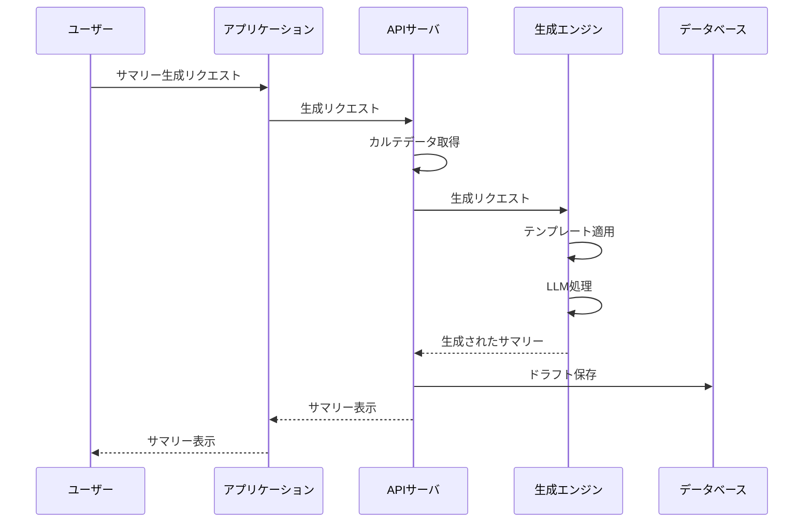
```mermaid
sequenceDiagram
    participant User as ユーザー
    participant App as アプリケーション
    participant API as APIサーバ
    participant Gen as 生成エンジン
    participant DB as データベース
    
    User->>App: サマリー生成リクエスト
    App->>API: 生成リクエスト
    API->>API: カルテデータ取得
    API->>Gen: 生成リクエスト
    Gen->>Gen: テンプレート適用
    Gen->>Gen: LLM処理
    Gen-->>API: 生成されたサマリー
    API->>DB: ドラフト保存
    API-->>App: サマリー表示
    App-->>User: サマリー表示
```

##### 入力項目

| 項目名 | データ型 | 必須/任意 | 説明 | 制約条件 |
|---|---|---|---|---|
| 患者ID | String | 必須 | 患者ID | 20文字以内 |
| 入院ID | String | 必須 | 入院ID | 20文字以内 |
| テンプレートバージョン | String | 任意 | 使用するテンプレートのバージョン | デフォルト: "1.0" |
| 看護記録を含める | Boolean | 任意 | 看護記録を含めるか | デフォルト: true |

##### 出力項目

| 項目名 | データ型 | 説明 |
|---|---|---|
| サマリーID | String | 生成されたサマリーのID |
| サマリー内容 | String | HTML形式のサマリー内容 |
| 生成日時 | DateTime | サマリー生成日時 |
| ステータス | String | ドラフト状態 |

##### 処理内容

1. 患者ID、入院IDを受け取る
2. 電子カルテシステムから必要なデータを取得
3. 取得したデータをテンプレートに適用
4. LLMエンジンに送信し、自然言語生成を実行
5. 生成されたサマリーをHTML形式に整形
6. データベースにドラフトとして保存
7. 生成されたサマリーを返却

##### エラーハンドリング

| エラー種別 | エラーコード | 処理内容 |
|---|---|---|
| データ取得エラー | DATA_FETCH_ERROR | エラーメッセージを返却、再試行を促す |
| 生成エンジンエラー | GENERATION_ERROR | エラーログを記録、エラーメッセージを返却 |
| タイムアウト | GENERATION_TIMEOUT | タイムアウトメッセージを返却、非同期処理に切り替え |
| テンプレートエラー | TEMPLATE_ERROR | エラーログを記録、デフォルトテンプレートを使用 |

#### 5.1.3 編集・修正機能（REQ03対応）

##### 機能概要

自動生成されたサマリーの内容を、医師が画面上で確認し、自由にテキストの追記、修正、削除を行えるWYSIWYGエディタ機能。

##### 処理フロー

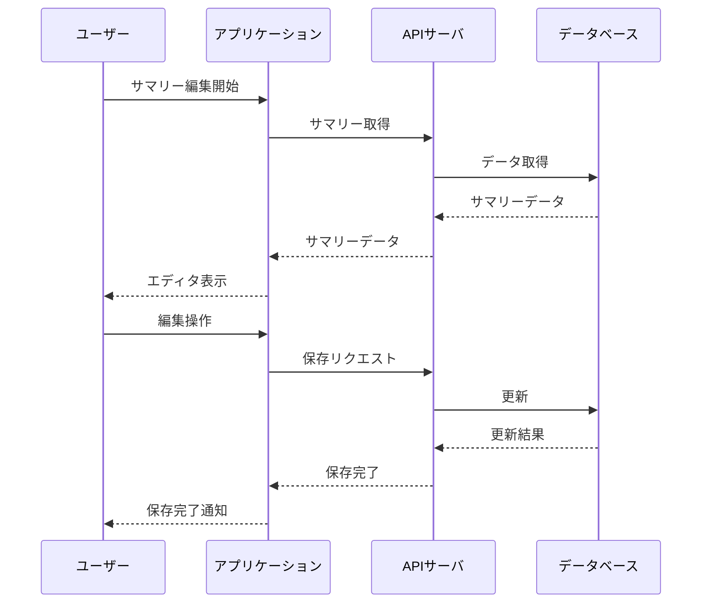
```mermaid
sequenceDiagram
    participant User as ユーザー
    participant App as アプリケーション
    participant API as APIサーバ
    participant DB as データベース
    
    User->>App: サマリー編集開始
    App->>API: サマリー取得
    API->>DB: データ取得
    DB-->>API: サマリーデータ
    API-->>App: サマリーデータ
    App-->>User: エディタ表示
    User->>App: 編集操作
    App->>API: 保存リクエスト
    API->>DB: 更新
    DB-->>API: 更新結果
    API-->>App: 保存完了
    App-->>User: 保存完了通知
```

##### 入力項目

| 項目名 | データ型 | 必須/任意 | 説明 | 制約条件 |
|---|---|---|---|---|
| サマリーID | String | 必須 | 編集対象のサマリーID | 20文字以内 |
| 編集内容 | String | 必須 | HTML形式の編集内容 | 最大10MB |

##### 出力項目

| 項目名 | データ型 | 説明 |
|---|---|---|
| 更新結果 | Boolean | 更新成功/失敗 |
| 更新日時 | DateTime | 更新日時 |
| バージョン | Integer | 更新後のバージョン番号 |

##### 処理内容

1. サマリーIDを受け取り、データベースからサマリーを取得
2. エディタにサマリー内容を表示
3. ユーザーの編集操作を受け付ける
4. 編集内容をバリデーション
5. データベースに保存（バージョン管理）
6. 保存完了を通知

##### エラーハンドリング

| エラー種別 | エラーコード | 処理内容 |
|---|---|---|
| サマリー未存在 | SUMMARY_NOT_FOUND | エラーメッセージを返却 |
| 編集権限なし | EDIT_PERMISSION_DENIED | エラーメッセージを返却 |
| バリデーションエラー | VALIDATION_ERROR | エラー箇所を特定してメッセージを返却 |
| 保存エラー | SAVE_ERROR | エラーログを記録、エラーメッセージを返却 |

#### 5.1.4 承認・保存機能（REQ04対応）

##### 機能概要

医師が内容を確認・修正後、承認操作を行うことで、完成したサマリーを正式な文書としてシステム内に保存し、電子カルテシステムに反映させる機能。

##### 処理フロー

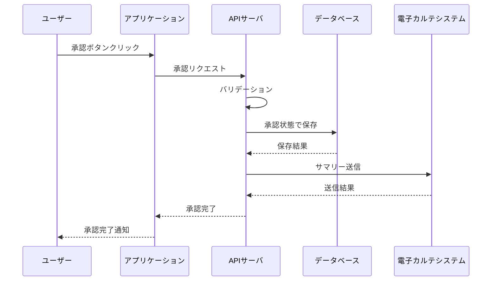
```mermaid
sequenceDiagram
    participant User as ユーザー
    participant App as アプリケーション
    participant API as APIサーバ
    participant DB as データベース
    participant EMR as 電子カルテシステム
    
    User->>App: 承認ボタンクリック
    App->>API: 承認リクエスト
    API->>API: バリデーション
    API->>DB: 承認状態で保存
    DB-->>API: 保存結果
    API->>EMR: サマリー送信
    EMR-->>API: 送信結果
    API-->>App: 承認完了
    App-->>User: 承認完了通知
```

##### 入力項目

| 項目名 | データ型 | 必須/任意 | 説明 | 制約条件 |
|---|---|---|---|---|
| サマリーID | String | 必須 | 承認対象のサマリーID | 20文字以内 |

##### 出力項目

| 項目名 | データ型 | 説明 |
|---|---|---|
| 承認結果 | Boolean | 承認成功/失敗 |
| 承認日時 | DateTime | 承認日時 |
| 承認者 | String | 承認者のユーザーID |

##### 処理内容

1. サマリーIDを受け取る
2. 必須項目チェック（患者基本情報、病名、治療経過が記載されていること）
3. データ整合性チェック
4. 承認権限チェック
5. データベースに承認状態で保存
6. 電子カルテシステムにサマリーを送信
7. 承認完了を通知

##### エラーハンドリング

| エラー種別 | エラーコード | 処理内容 |
|---|---|---|
| 必須項目不足 | REQUIRED_FIELD_MISSING | 不足項目を特定してメッセージを返却 |
| 承認権限なし | APPROVAL_PERMISSION_DENIED | エラーメッセージを返却 |
| 電子カルテ送信エラー | EMR_SEND_ERROR | エラーログを記録、リトライ処理を実施 |
| 保存エラー | SAVE_ERROR | エラーログを記録、エラーメッセージを返却 |

#### 5.1.5 出力機能（REQ05対応）

##### 機能概要

完成した退院時サマリーを、指定されたフォーマットのPDFファイルとして出力、またはプリンターで印刷する機能。

##### 処理フロー

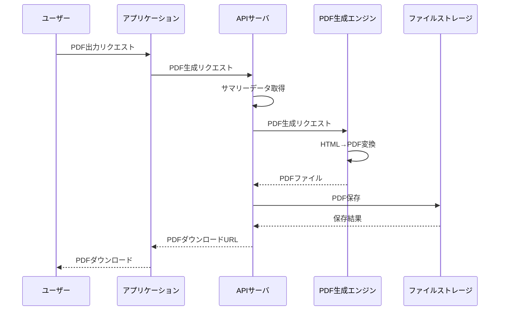
```mermaid
sequenceDiagram
    participant User as ユーザー
    participant App as アプリケーション
    participant API as APIサーバ
    participant PDF as PDF生成エンジン
    participant Storage as ファイルストレージ
    
    User->>App: PDF出力リクエスト
    App->>API: PDF生成リクエスト
    API->>API: サマリーデータ取得
    API->>PDF: PDF生成リクエスト
    PDF->>PDF: HTML→PDF変換
    PDF-->>API: PDFファイル
    API->>Storage: PDF保存
    Storage-->>API: 保存結果
    API-->>App: PDFダウンロードURL
    App-->>User: PDFダウンロード
```

##### 入力項目

| 項目名 | データ型 | 必須/任意 | 説明 | 制約条件 |
|---|---|---|---|---|
| サマリーID | String | 必須 | 出力対象のサマリーID | 20文字以内 |
| 出力形式 | String | 必須 | PDF/印刷 | "PDF" or "PRINT" |

##### 出力項目

| 項目名 | データ型 | 説明 |
|---|---|---|
| PDFファイル | Binary | PDF形式のファイル |
| ダウンロードURL | String | PDFファイルのダウンロードURL |

##### 処理内容

1. サマリーIDを受け取る
2. データベースからサマリーを取得
3. HTML形式のサマリーをPDF形式に変換
4. PDFファイルをファイルストレージに保存
5. ダウンロードURLを生成して返却
6. 印刷の場合は、ブラウザの印刷機能を呼び出し

##### エラーハンドリング

| エラー種別 | エラーコード | 処理内容 |
|---|---|---|
| サマリー未存在 | SUMMARY_NOT_FOUND | エラーメッセージを返却 |
| PDF生成エラー | PDF_GENERATION_ERROR | エラーログを記録、エラーメッセージを返却 |
| ファイル保存エラー | FILE_SAVE_ERROR | エラーログを記録、エラーメッセージを返却 |

### 5.2 補助機能設計

#### 5.2.1 認証・認可機能

##### 認証方式

- 方式: OAuth 2.0 / OpenID Connect
- 認証プロバイダー: 院内認証システム

##### 認証フロー

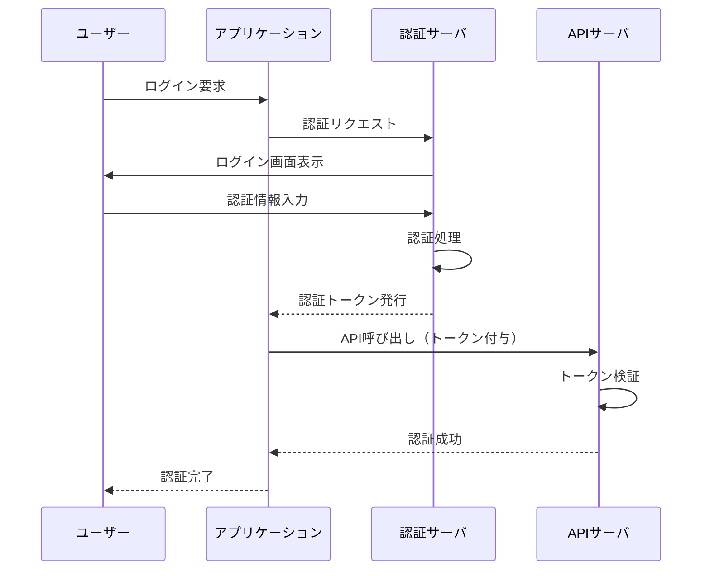
```mermaid
sequenceDiagram
    participant User as ユーザー
    participant App as アプリケーション
    participant Auth as 認証サーバ
    participant API as APIサーバ
    
    User->>App: ログイン要求
    App->>Auth: 認証リクエスト
    Auth->>User: ログイン画面表示
    User->>Auth: 認証情報入力
    Auth->>Auth: 認証処理
    Auth-->>App: 認証トークン発行
    App->>API: API呼び出し（トークン付与）
    API->>API: トークン検証
    API-->>App: 認証成功
    App-->>User: 認証完了
```

##### 認可（権限管理）

| 権限レベル | 権限内容 |
|---|---|
| 医師 | サマリー作成、編集、承認、出力 |
| 医療情報管理者 | システム管理、データ閲覧 |
| 閲覧者 | サマリー閲覧のみ |

##### 認可フロー

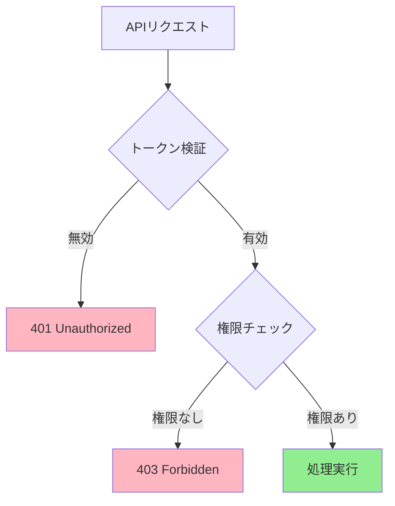
```mermaid
flowchart TD
    Request[APIリクエスト] --> CheckToken{トークン検証}
    CheckToken -->|無効| Reject1[401 Unauthorized]
    CheckToken -->|有効| CheckRole{権限チェック}
    CheckRole -->|権限なし| Reject2[403 Forbidden]
    CheckRole -->|権限あり| Allow[処理実行]
    
    style Reject1 fill:#FFB6C1
    style Reject2 fill:#FFB6C1
    style Allow fill:#90EE90
```

#### 5.2.2 ログ機能

| ログ種別 | 記録内容 | 保存期間 |
|---|---|---|
| アクセスログ | ユーザーアクセス履歴 | 1年 |
| 操作ログ | サマリー作成、編集、承認履歴 | 7年 |
| エラーログ | システムエラー情報 | 1年 |
| 監査ログ | セキュリティ関連イベント | 7年 |

## 6. データベース設計

### 6.1 データモデル

#### 6.1.1 ER図

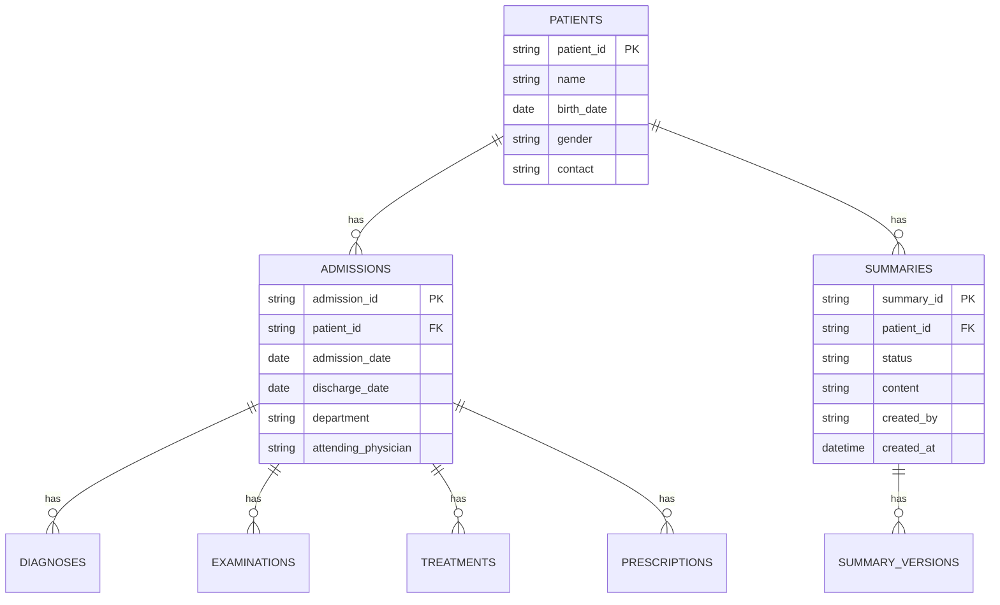
```mermaid
erDiagram
    PATIENTS ||--o{ ADMISSIONS : has
    PATIENTS ||--o{ SUMMARIES : has
    ADMISSIONS ||--o{ DIAGNOSES : has
    ADMISSIONS ||--o{ EXAMINATIONS : has
    ADMISSIONS ||--o{ TREATMENTS : has
    ADMISSIONS ||--o{ PRESCRIPTIONS : has
    SUMMARIES ||--o{ SUMMARY_VERSIONS : has
    
    PATIENTS {
        string patient_id PK
        string name
        date birth_date
        string gender
        string contact
    }
    
    ADMISSIONS {
        string admission_id PK
        string patient_id FK
        date admission_date
        date discharge_date
        string department
        string attending_physician
    }
    
    SUMMARIES {
        string summary_id PK
        string patient_id FK
        string status
        string content
        string created_by
        datetime created_at
    }
```

#### 6.1.2 テーブル定義

##### 患者テーブル（PATIENTS）

患者の基本情報を管理するテーブル

| カラム名 | データ型 | 制約 | 説明 | 対応要件ID | 備考 |
|---|---|---|---|---|---|
| patient_id | VARCHAR(20) | PK, NOT NULL | 患者ID | REQ12 | |
| name | VARCHAR(100) | NOT NULL | 氏名 | REQ12 | |
| name_kana | VARCHAR(200) | | 氏名カナ | | |
| birth_date | DATE | NOT NULL | 生年月日 | REQ12 | |
| gender | VARCHAR(10) | NOT NULL | 性別 | REQ12 | |
| contact | VARCHAR(200) | | 連絡先 | REQ12 | |
| created_at | TIMESTAMP | NOT NULL | 作成日時 | | |
| updated_at | TIMESTAMP | NOT NULL | 更新日時 | | |

##### インデックス定義

| インデックス名 | カラム名 | 種別 | 説明 |
|---|---|---|---|
| idx_patients_patient_id | patient_id | UNIQUE | 患者ID検索用 |
| idx_patients_name | name | NON-UNIQUE | 氏名検索用 |

##### 入院情報テーブル（ADMISSIONS）

入院情報を管理するテーブル

| カラム名 | データ型 | 制約 | 説明 | 対応要件ID | 備考 |
|---|---|---|---|---|---|
| admission_id | VARCHAR(20) | PK, NOT NULL | 入院ID | REQ13 | |
| patient_id | VARCHAR(20) | FK, NOT NULL | 患者ID | REQ13 | |
| admission_date | DATE | NOT NULL | 入院日 | REQ13 | |
| discharge_date | DATE | | 退院日 | REQ13 | |
| department | VARCHAR(50) | NOT NULL | 入院診療科 | REQ13 | |
| attending_physician | VARCHAR(100) | NOT NULL | 主治医 | REQ13 | |
| ward | VARCHAR(50) | | 病棟 | REQ13 | |
| created_at | TIMESTAMP | NOT NULL | 作成日時 | | |
| updated_at | TIMESTAMP | NOT NULL | 更新日時 | | |

##### インデックス定義

| インデックス名 | カラム名 | 種別 | 説明 |
|---|---|---|---|
| idx_admissions_patient_id | patient_id | NON-UNIQUE | 患者ID検索用 |
| idx_admissions_admission_date | admission_date | NON-UNIQUE | 入院日検索用 |

##### サマリーテーブル（SUMMARIES）

退院時サマリーを管理するテーブル

| カラム名 | データ型 | 制約 | 説明 | 対応要件ID | 備考 |
|---|---|---|---|---|---|
| summary_id | VARCHAR(20) | PK, NOT NULL | サマリーID | REQ04 | |
| patient_id | VARCHAR(20) | FK, NOT NULL | 患者ID | | |
| admission_id | VARCHAR(20) | FK, NOT NULL | 入院ID | | |
| status | VARCHAR(20) | NOT NULL | ステータス | REQ04 | draft/approved/sent |
| content | TEXT | | サマリー内容（HTML形式） | REQ02, REQ03 | |
| created_by | VARCHAR(50) | NOT NULL | 作成者 | | |
| created_at | TIMESTAMP | NOT NULL | 作成日時 | | |
| approved_by | VARCHAR(50) | | 承認者 | REQ04 | |
| approved_at | TIMESTAMP | | 承認日時 | REQ04 | |
| version | INTEGER | NOT NULL | バージョン | | デフォルト: 1 |

##### インデックス定義

| インデックス名 | カラム名 | 種別 | 説明 |
|---|---|---|---|
| idx_summaries_patient_id | patient_id | NON-UNIQUE | 患者ID検索用 |
| idx_summaries_status | status | NON-UNIQUE | ステータス検索用 |
| idx_summaries_created_at | created_at | NON-UNIQUE | 作成日時検索用 |

### 6.2 データ連携設計

#### 6.2.1 データ同期方式

| 同期方式 | 説明 | 使用ケース | 頻度 |
|---|---|---|---|
| リアルタイム同期 | API経由でリアルタイムに取得 | サマリー作成時 | オンデマンド |
| バッチ同期 | 定期的にデータを同期 | データ整合性確保 | 日次 |

#### 6.2.2 データ変換ルール

| 元データ形式 | 変換後形式 | 変換ルール |
|---|---|---|
| EMR患者ID | システム患者ID | IDマッピングテーブル参照 |
| EMR日付形式（YYYYMMDD） | システム日付形式（YYYY-MM-DD） | フォーマット変換 |
| EMR病名コード | ICD-10コード | コード変換テーブル参照 |

#### 6.2.3 データフロー図

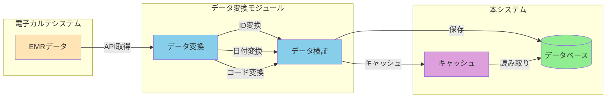
```mermaid
flowchart LR
    subgraph 電子カルテシステム
        EMR[EMRデータ]
    end
    
    subgraph データ変換モジュール
        Transform[データ変換]
        Validate[データ検証]
    end
    
    subgraph 本システム
        DB[(データベース)]
        Cache[キャッシュ]
    end
    
    EMR -->|API取得| Transform
    Transform -->|ID変換| Validate
    Transform -->|日付変換| Validate
    Transform -->|コード変換| Validate
    Validate -->|保存| DB
    Validate -->|キャッシュ| Cache
    Cache -->|読み取り| DB
    
    style EMR fill:#FFE4B5
    style Transform fill:#87CEEB
    style Validate fill:#87CEEB
    style DB fill:#90EE90
    style Cache fill:#DDA0DD
```

### 6.3 データ保持・バックアップ設計

| データ種別 | 保持期間 | バックアップ頻度 | バックアップ先 | 備考 |
|---|---|---|---|---|
| サマリーデータ | 7年 | 日次 | オフサイトストレージ | 医療記録としての保存期間 |
| ログデータ | 1-7年 | 日次 | オフサイトストレージ | ログ種別により異なる |
| 一時データ | 30日 | なし | - | 自動削除 |

## 7. 画面設計

### 7.1 画面一覧

| 画面ID | 画面名 | 対応要件ID | 優先度 | 備考 |
|---|---|---|---|---|
| SCR-001 | ログイン画面 | - | 高 | |
| SCR-002 | 患者選択画面 | REQ06 | 高 | |
| SCR-003 | サマリー編集画面 | REQ07 | 高 | |
| SCR-004 | サマリー一覧画面 | - | 中 | |
| SCR-005 | 設定画面 | - | 低 | |

#### 7.1.0 画面遷移図

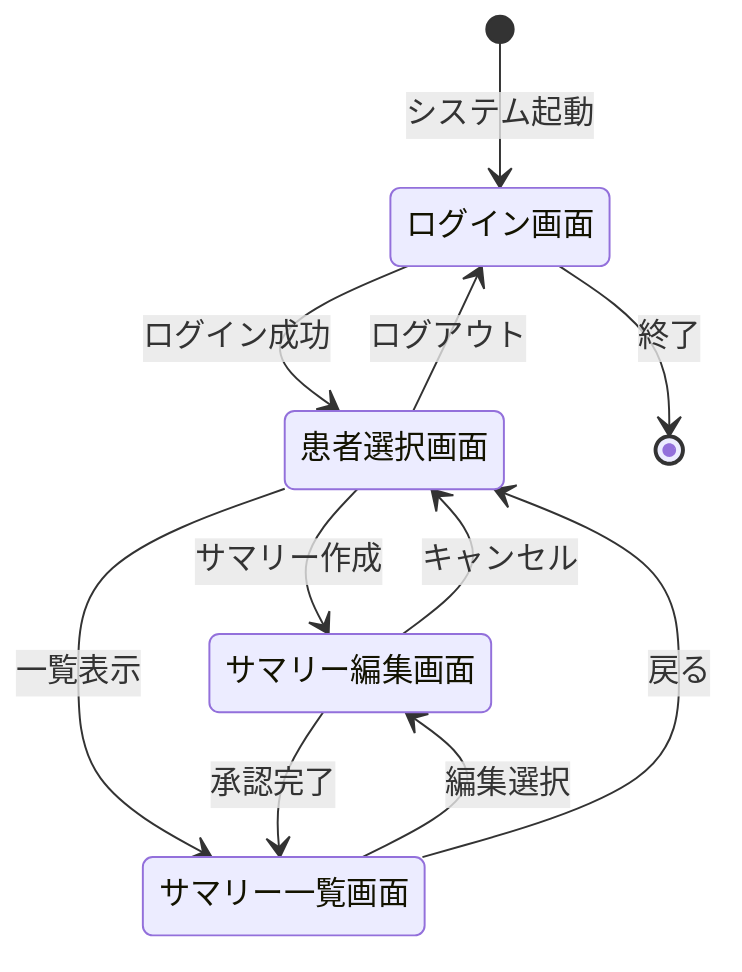
```mermaid
stateDiagram-v2
    [*] --> ログイン画面: システム起動
    ログイン画面 --> 患者選択画面: ログイン成功
    患者選択画面 --> サマリー編集画面: サマリー作成
    患者選択画面 --> サマリー一覧画面: 一覧表示
    サマリー編集画面 --> 患者選択画面: キャンセル
    サマリー編集画面 --> サマリー一覧画面: 承認完了
    サマリー一覧画面 --> サマリー編集画面: 編集選択
    サマリー一覧画面 --> 患者選択画面: 戻る
    患者選択画面 --> ログイン画面: ログアウト
    ログイン画面 --> [*]: 終了
```

### 7.1.1 患者選択画面（REQ06対応）

#### 画面概要

患者を検索・選択し、サマリー作成を開始する画面。ヘッダー、患者検索エリア、患者一覧表示エリアで構成される。

#### 画面レイアウト

```
┌─────────────────────────────────────────┐
│ ヘッダー（ロゴ、ユーザー名、ログアウト） │
├─────────────────────────────────────────┤
│ 検索エリア                               │
│ ┌─────────────────────────────────────┐ │
│ │ 患者ID: [________] 氏名: [________] │ │
│ │ [検索] [クリア]                     │ │
│ └─────────────────────────────────────┘ │
├─────────────────────────────────────────┤
│ 患者一覧                                 │
│ ┌─────────────────────────────────────┐ │
│ │ ID  │ 氏名 │ 入院日 │ 主治医 │操作│ │
│ ├─────┼──────┼────────┼────────┼───┤ │
│ │ ... │ ...  │ ...    │ ...    │...│ │
│ └─────────────────────────────────────┘ │
│ [前へ] [次へ]                            │
└─────────────────────────────────────────┘
```

#### 画面項目定義

| 項目名 | 項目ID | 型 | 必須 | 説明 | 制約条件 |
|---|---|---|---|---|---|
| 患者ID検索 | SEARCH_PATIENT_ID | Text | 任意 | 患者IDで検索 | 20文字以内 |
| 氏名検索 | SEARCH_NAME | Text | 任意 | 氏名で検索 | 100文字以内 |
| 検索ボタン | BTN_SEARCH | Button | - | 検索実行 | |
| クリアボタン | BTN_CLEAR | Button | - | 検索条件クリア | |
| 患者一覧テーブル | TABLE_PATIENTS | Table | - | 患者一覧表示 | |
| サマリー作成ボタン | BTN_CREATE | Button | - | サマリー作成開始 | |

#### 画面遷移

| 遷移元 | 遷移先 | 条件 | 備考 |
|---|---|---|---|
| ログイン画面 | 患者選択画面 | ログイン成功時 | |
| 患者選択画面 | サマリー編集画面 | サマリー作成ボタンクリック時 | |
| 患者選択画面 | サマリー一覧画面 | サマリー一覧ボタンクリック時 | |

#### 画面操作フロー

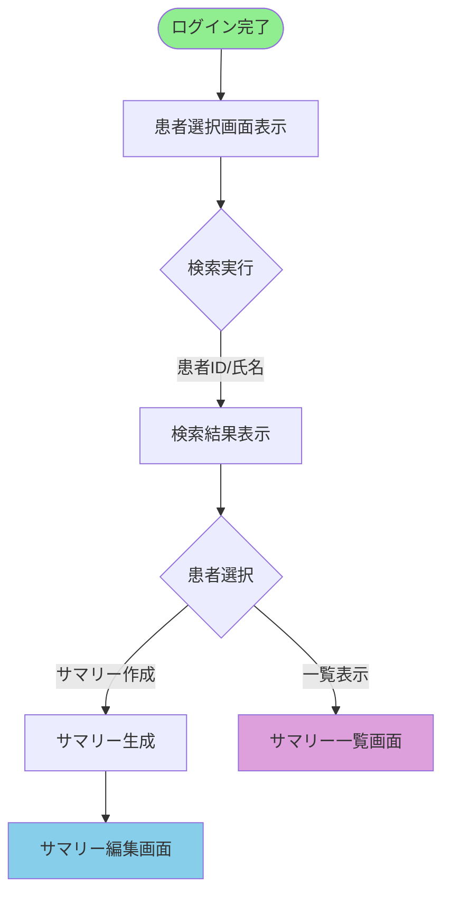
```mermaid
flowchart TD
    Start([ログイン完了]) --> Display[患者選択画面表示]
    Display --> Search{検索実行}
    Search -->|患者ID/氏名| Result[検索結果表示]
    Result --> Select{患者選択}
    Select -->|サマリー作成| Generate[サマリー生成]
    Generate --> Edit[サマリー編集画面]
    Select -->|一覧表示| List[サマリー一覧画面]
    
    style Start fill:#90EE90
    style Edit fill:#87CEEB
    style List fill:#DDA0DD
```

1. ログイン後、患者選択画面が表示される
2. 患者IDまたは氏名で検索を実行
3. 検索結果が一覧テーブルに表示される
4. 対象患者を選択し、サマリー作成ボタンをクリック
5. サマリー編集画面に遷移

### 7.1.2 サマリー編集画面（REQ07対応）

#### 画面概要

自動生成されたサマリーを編集・修正する画面。左側に入力元となる電子カルテ情報（カルテビューア）、右側に自動生成されたサマリーの編集エリアを配置する2ペイン構成。

#### 画面レイアウト

```
┌─────────────────────────────────────────────────────────┐
│ ヘッダー（患者名、入院日、退院日）                        │
├──────────────┬──────────────────────────────────────────┤
│              │ サマリー編集エリア                        │
│ カルテ情報   │ ┌──────────────────────────────────────┐ │
│ 表示エリア   │ │ [リッチテキストエディタ]              │ │
│              │ │                                      │ │
│ - 基本情報   │ │                                      │ │
│ - 病名       │ │                                      │ │
│ - 検査結果   │ │                                      │ │
│ - 治療経過   │ │                                      │ │
│              │ └──────────────────────────────────────┘ │
│              │ [保存] [承認] [PDF出力] [キャンセル]     │
└──────────────┴──────────────────────────────────────────┘
```

#### 画面項目定義

| 項目名 | 項目ID | 型 | 必須 | 説明 | 制約条件 |
|---|---|---|---|---|---|
| カルテ情報表示 | AREA_CHART_INFO | Area | - | 電子カルテ情報表示 | |
| サマリーエディタ | EDITOR_SUMMARY | RichTextEditor | 必須 | サマリー編集 | |
| 保存ボタン | BTN_SAVE | Button | - | ドラフト保存 | |
| 承認ボタン | BTN_APPROVE | Button | - | 承認・確定 | |
| PDF出力ボタン | BTN_PDF | Button | - | PDF出力 | |
| キャンセルボタン | BTN_CANCEL | Button | - | 編集キャンセル | |

#### 画面遷移

| 遷移元 | 遷移先 | 条件 | 備考 |
|---|---|---|---|
| 患者選択画面 | サマリー編集画面 | サマリー作成時 | |
| サマリー編集画面 | 患者選択画面 | キャンセル時 | |
| サマリー編集画面 | サマリー一覧画面 | 承認時 | |

#### 画面操作フロー

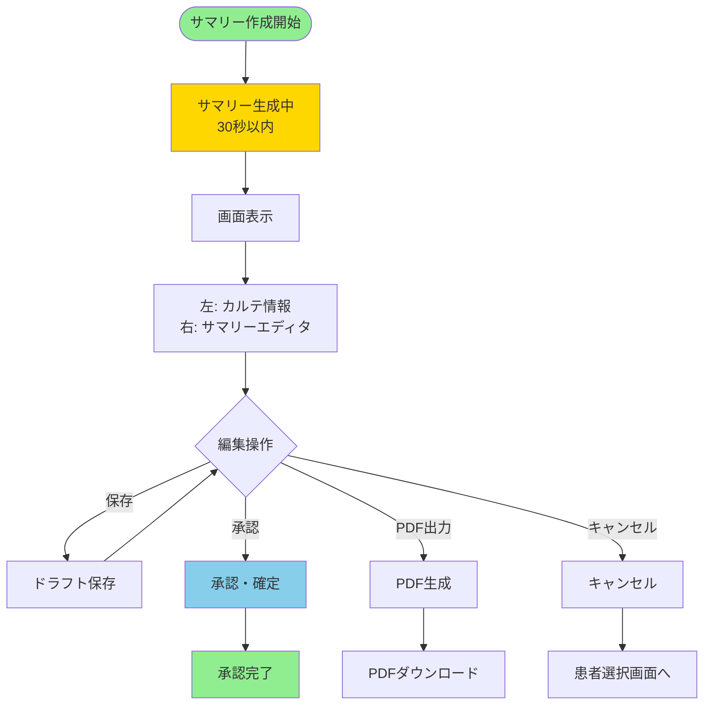
```mermaid
flowchart TD
    Start([サマリー作成開始]) --> Loading[サマリー生成中<br/>30秒以内]
    Loading --> Display[画面表示]
    Display --> Show[左: カルテ情報<br/>右: サマリーエディタ]
    Show --> Edit{編集操作}
    Edit -->|保存| Save[ドラフト保存]
    Edit -->|承認| Approve[承認・確定]
    Edit -->|PDF出力| PDF[PDF生成]
    Edit -->|キャンセル| Cancel[キャンセル]
    Save --> Edit
    Approve --> Complete[承認完了]
    PDF --> Download[PDFダウンロード]
    Cancel --> Return[患者選択画面へ]
    
    style Start fill:#90EE90
    style Loading fill:#FFD700
    style Approve fill:#87CEEB
    style Complete fill:#90EE90
```

1. 患者選択画面からサマリー作成を開始
2. システムがサマリーを自動生成（30秒以内）
3. 左側にカルテ情報、右側に生成されたサマリーが表示される
4. エディタでサマリーを編集・修正
5. 保存ボタンでドラフト保存、承認ボタンで承認・確定
6. PDF出力ボタンでPDFファイルを生成・ダウンロード

### 7.2 UI/UX設計

#### 7.2.1 デザイン原則

- シンプルで直感的な操作性
- 医療現場での使用を考慮した視認性
- アクセシビリティへの配慮（WCAG 2.1 AA準拠）
- エラーメッセージは分かりやすく表示

#### 7.2.2 カラースキーム

| 用途 | カラーコード | 説明 |
|---|---|---|
| プライマリ | #0066CC | 主要なアクション |
| セカンダリ | #666666 | 補助的な要素 |
| 成功 | #00AA00 | 成功メッセージ |
| 警告 | #FF9900 | 警告メッセージ |
| エラー | #CC0000 | エラーメッセージ |
| 背景 | #FFFFFF | 画面背景 |

#### 7.2.3 レスポンシブデザイン

| デバイス | 画面幅 | 対応方針 |
|---|---|---|
| PC | 1024px以上 | フル機能対応 |
| タブレット | 768px-1023px | 主要機能対応 |
| スマートフォン | 767px以下 | 閲覧のみ対応（初版では対象外） |

## 8. API設計

### 8.1 API一覧

| API ID | API名 | メソッド | エンドポイント | 対応要件ID | 説明 |
|---|---|---|---|---|---|
| API-001 | 患者データ取得 | GET | /api/v1/patients/{id} | REQ01, REQ12-REQ19 | 電子カルテシステムから患者データを取得 |
| API-002 | サマリー生成 | POST | /api/v1/summaries/generate | REQ02 | サマリーを自動生成 |
| API-003 | サマリー取得 | GET | /api/v1/summaries/{id} | REQ03 | サマリーを取得 |
| API-004 | サマリー更新 | PUT | /api/v1/summaries/{id} | REQ03 | サマリーを更新 |
| API-005 | サマリー承認 | POST | /api/v1/summaries/{id}/approve | REQ04 | サマリーを承認 |
| API-006 | PDF生成 | POST | /api/v1/summaries/{id}/pdf | REQ05 | PDFファイルを生成 |

### 8.2 API詳細設計

#### 8.2.1 患者データ取得API（API-001）

##### API概要

電子カルテシステムから患者の基本情報、入院情報、病名、検査結果、治療経過などのデータを取得するAPI。

##### エンドポイント

`GET /api/v1/patients/{patientId}`

##### メソッド

GET

##### 認証

Bearer Token必須

##### リクエスト

| パラメータ名 | 型 | 位置 | 必須 | 説明 | 制約条件 |
|---|---|---|---|---|---|
| patientId | String | Path | 必須 | 患者ID | 20文字以内 |
| admissionId | String | Query | 任意 | 入院ID | 20文字以内 |

##### レスポンス

成功時のレスポンス例（JSONスキーマ）

```json
{
  "patientId": "P001",
  "basicInfo": {
    "name": "山田 太郎",
    "birthDate": "1980-01-01",
    "gender": "男性",
    "contact": "03-1234-5678"
  },
  "admissionInfo": {
    "admissionId": "A001",
    "admissionDate": "2024-01-01",
    "dischargeDate": "2024-01-15",
    "department": "内科",
    "attendingPhysician": "佐藤 一郎",
    "ward": "3階東病棟"
  },
  "diagnoses": [
    {
      "code": "I10",
      "name": "本態性高血圧症",
      "type": "primary"
    }
  ],
  "examinations": {
    "bloodTests": [],
    "imagingTests": []
  },
  "treatments": "降圧薬を処方し、経過観察を行った。",
  "nursingRecords": "特に問題なし。",
  "prescriptions": [],
  "guidance": "塩分制限、適度な運動を心がけること。"
}
```

エラー時のレスポンス例（JSONスキーマ）

```json
{
  "error": {
    "code": "PATIENT_NOT_FOUND",
    "message": "指定された患者が見つかりません。",
    "details": {}
  }
}
```

##### エラーハンドリング

| HTTPステータス | エラーコード | 説明 |
|---|---|---|
| 400 | INVALID_PATIENT_ID | 無効な患者ID |
| 401 | UNAUTHORIZED | 認証エラー |
| 403 | FORBIDDEN | アクセス権限なし |
| 404 | PATIENT_NOT_FOUND | 患者が見つからない |
| 500 | INTERNAL_ERROR | サーバーエラー |
| 503 | EMR_SYSTEM_ERROR | 電子カルテシステムエラー |

#### 8.2.2 サマリー生成API（API-002）

##### API概要

電子カルテ情報を基に、退院時サマリーのドラフトを自動生成するAPI。

##### エンドポイント

`POST /api/v1/summaries/generate`

##### メソッド

POST

##### 認証

Bearer Token必須

##### リクエスト

リクエストボディのJSONスキーマ例

```json
{
  "patientId": "P001",
  "admissionId": "A001",
  "options": {
    "templateVersion": "1.0",
    "includeNursingRecords": true
  }
}
```

| パラメータ名 | 型 | 位置 | 必須 | 説明 | 制約条件 |
|---|---|---|---|---|---|
| patientId | String | Body | 必須 | 患者ID | 20文字以内 |
| admissionId | String | Body | 必須 | 入院ID | 20文字以内 |
| options | Object | Body | 任意 | 生成オプション | |
| options.templateVersion | String | Body | 任意 | テンプレートバージョン | デフォルト: "1.0" |
| options.includeNursingRecords | Boolean | Body | 任意 | 看護記録を含めるか | デフォルト: true |

##### レスポンス

成功時のレスポンス例（JSONスキーマ）

```json
{
  "summaryId": "S001",
  "patientId": "P001",
  "status": "draft",
  "content": "<html>...</html>",
  "createdAt": "2024-01-15T10:00:00Z"
}
```

##### エラーハンドリング

| HTTPステータス | エラーコード | 説明 |
|---|---|---|
| 400 | INVALID_REQUEST | リクエストが不正 |
| 401 | UNAUTHORIZED | 認証エラー |
| 500 | GENERATION_ERROR | 生成エラー |
| 503 | GENERATION_TIMEOUT | 生成タイムアウト |

#### 8.2.3 サマリー取得API（API-003）

##### API概要

保存されているサマリーを取得するAPI。

##### エンドポイント

`GET /api/v1/summaries/{summaryId}`

##### メソッド

GET

##### 認証

Bearer Token必須

##### リクエスト

| パラメータ名 | 型 | 位置 | 必須 | 説明 | 制約条件 |
|---|---|---|---|---|---|
| summaryId | String | Path | 必須 | サマリーID | 20文字以内 |

##### レスポンス

成功時のレスポンス例（JSONスキーマ）

```json
{
  "summaryId": "S001",
  "patientId": "P001",
  "admissionId": "A001",
  "status": "draft",
  "content": "<html>...</html>",
  "version": 1,
  "createdBy": "user001",
  "createdAt": "2024-01-15T10:00:00Z",
  "approvedBy": null,
  "approvedAt": null
}
```

#### 8.2.4 サマリー更新API（API-004）

##### API概要

サマリーの内容を更新するAPI。

##### エンドポイント

`PUT /api/v1/summaries/{summaryId}`

##### メソッド

PUT

##### 認証

Bearer Token必須

##### リクエスト

リクエストボディのJSONスキーマ例

```json
{
  "content": "<html>...</html>"
}
```

| パラメータ名 | 型 | 位置 | 必須 | 説明 | 制約条件 |
|---|---|---|---|---|---|
| summaryId | String | Path | 必須 | サマリーID | 20文字以内 |
| content | String | Body | 必須 | サマリー内容（HTML形式） | 最大10MB |

##### レスポンス

成功時のレスポンス例（JSONスキーマ）

```json
{
  "summaryId": "S001",
  "version": 2,
  "updatedAt": "2024-01-15T11:00:00Z"
}
```

#### 8.2.5 サマリー承認API（API-005）

##### API概要

サマリーを承認し、電子カルテシステムに送信するAPI。

##### エンドポイント

`POST /api/v1/summaries/{summaryId}/approve`

##### メソッド

POST

##### 認証

Bearer Token必須

##### リクエスト

| パラメータ名 | 型 | 位置 | 必須 | 説明 | 制約条件 |
|---|---|---|---|---|---|
| summaryId | String | Path | 必須 | サマリーID | 20文字以内 |

##### レスポンス

成功時のレスポンス例（JSONスキーマ）

```json
{
  "summaryId": "S001",
  "status": "approved",
  "approvedBy": "user001",
  "approvedAt": "2024-01-15T12:00:00Z"
}
```

#### 8.2.6 PDF生成API（API-006）

##### API概要

サマリーをPDFファイルとして生成するAPI。

##### エンドポイント

`POST /api/v1/summaries/{summaryId}/pdf`

##### メソッド

POST

##### 認証

Bearer Token必須

##### リクエスト

| パラメータ名 | 型 | 位置 | 必須 | 説明 | 制約条件 |
|---|---|---|---|---|---|
| summaryId | String | Path | 必須 | サマリーID | 20文字以内 |

##### レスポンス

成功時のレスポンス例（JSONスキーマ）

```json
{
  "summaryId": "S001",
  "pdfUrl": "https://example.com/api/v1/files/pdf/S001.pdf",
  "expiresAt": "2024-01-16T12:00:00Z"
}
```

### 8.3 エラーハンドリング

#### 8.3.1 エラーコード一覧

| エラーコード | HTTPステータス | 説明 |
|---|---|---|
| INVALID_REQUEST | 400 | リクエストが不正 |
| UNAUTHORIZED | 401 | 認証が必要 |
| FORBIDDEN | 403 | アクセス権限なし |
| NOT_FOUND | 404 | リソースが見つからない |
| CONFLICT | 409 | リソースの競合 |
| INTERNAL_ERROR | 500 | サーバー内部エラー |
| SERVICE_UNAVAILABLE | 503 | サービス利用不可 |

#### 8.3.2 エラーレスポンス形式

エラーレスポンスの共通形式

```json
{
  "error": {
    "code": "ERROR_CODE",
    "message": "エラーメッセージ",
    "details": {
      "field": "エラーが発生したフィールド",
      "reason": "エラー理由"
    },
    "timestamp": "2024-01-15T10:00:00Z",
    "requestId": "req-123456"
  }
}
```

#### 8.3.3 エラーハンドリングフロー

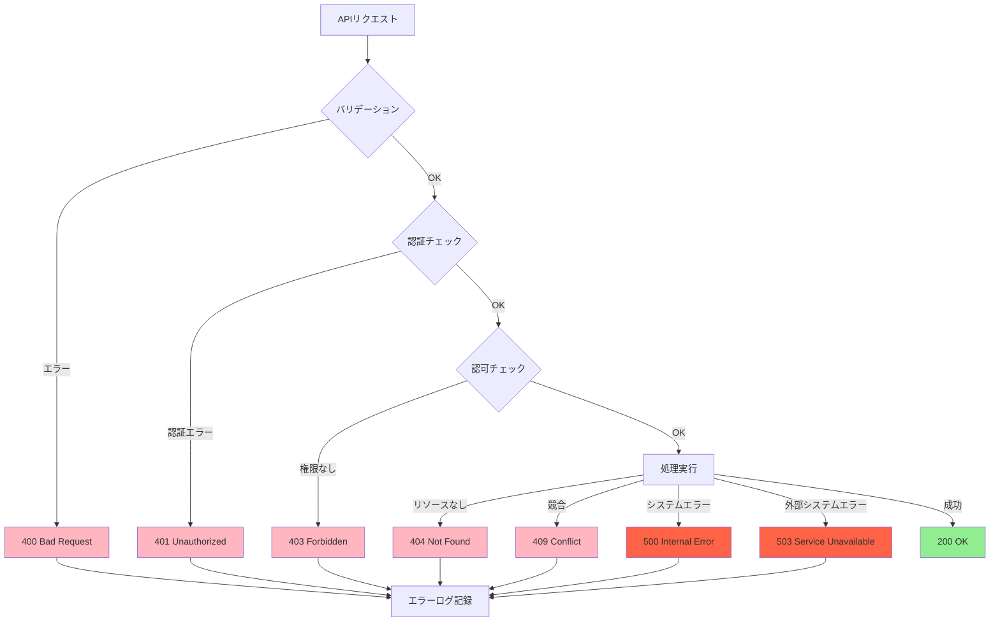
```mermaid
flowchart TD
    Request[APIリクエスト] --> Validate{バリデーション}
    Validate -->|エラー| Error400[400 Bad Request]
    Validate -->|OK| Auth{認証チェック}
    Auth -->|認証エラー| Error401[401 Unauthorized]
    Auth -->|OK| Authorize{認可チェック}
    Authorize -->|権限なし| Error403[403 Forbidden]
    Authorize -->|OK| Process[処理実行]
    Process -->|リソースなし| Error404[404 Not Found]
    Process -->|競合| Error409[409 Conflict]
    Process -->|システムエラー| Error500[500 Internal Error]
    Process -->|外部システムエラー| Error503[503 Service Unavailable]
    Process -->|成功| Success[200 OK]
    
    Error400 --> Log[エラーログ記録]
    Error401 --> Log
    Error403 --> Log
    Error404 --> Log
    Error409 --> Log
    Error500 --> Log
    Error503 --> Log
    
    style Error400 fill:#FFB6C1
    style Error401 fill:#FFB6C1
    style Error403 fill:#FFB6C1
    style Error404 fill:#FFB6C1
    style Error409 fill:#FFB6C1
    style Error500 fill:#FF6347
    style Error503 fill:#FF6347
    style Success fill:#90EE90
```

## 9. 非機能要件設計

### 9.1 パフォーマンス設計（REQ08対応）

#### 9.1.1 性能目標

| 処理 | 目標値 | 測定方法 | 備考 |
|---|---|---|---|
| サマリー生成時間 | 30秒以内 | 患者選択からサマリー表示まで | REQ08 |
| API応答時間 | 1秒以内（95パーセンタイル） | API呼び出しからレスポンスまで | |
| 画面表示時間 | 2秒以内 | ページ遷移から表示完了まで | |
| 同時接続数 | 100ユーザー | システム全体 | |

#### 9.1.2 パフォーマンス対策

| 対策 | 説明 | 効果 |
|---|---|---|
| キャッシュ | 頻繁にアクセスされるデータをキャッシュ | レスポンス時間短縮 |
| 非同期処理 | サマリー生成を非同期で処理 | ユーザー体験向上 |
| データベース最適化 | インデックス最適化、クエリチューニング | クエリ実行時間短縮 |
| CDN利用 | 静的コンテンツの配信最適化 | 画面表示時間短縮 |

### 9.2 セキュリティ設計（REQ09対応）

#### 9.2.1 認証・認可

| 項目 | 仕様 | 備考 |
|---|---|---|
| 認証方式 | OAuth 2.0 / OpenID Connect | |
| セッション管理 | JWT（JSON Web Token） | |
| パスワードポリシー | 複雑度要件、有効期限設定 | |
| 多要素認証 | 必要に応じて実装 | |

#### 9.2.2 通信セキュリティ

| 項目 | 仕様 | 備考 |
|---|---|---|
| 通信暗号化 | TLS 1.3以上 | REQ09 |
| 証明書 | 信頼できるCA発行の証明書 | |
| 証明書検証 | 厳格な証明書検証 | |

#### 9.2.3 データセキュリティ

| 項目 | 仕様 | 備考 |
|---|---|---|
| データベース暗号化 | 保存時暗号化（AES-256） | REQ09 |
| 個人情報保護 | 匿名化、マスキング | |
| アクセスログ | すべてのアクセスを記録 | |
| 監査ログ | 重要な操作を記録 | |

#### 9.2.4 セキュリティ対策

| 対策 | 説明 | 実装方法 |
|---|---|---|
| SQLインジェクション対策 | プリペアドステートメント使用 | ORM使用 |
| XSS対策 | 入力値のサニタイズ、エスケープ | ライブラリ使用 |
| CSRF対策 | CSRFトークン使用 | フレームワーク機能 |
| セキュリティヘッダー | CSP、X-Frame-Options等の設定 | ミドルウェア設定 |

### 9.3 可用性設計（REQ10対応）

#### 9.3.1 可用性目標

| 項目 | 目標値 | 備考 |
|---|---|---|
| 稼働率 | 99.5%以上 | REQ10 |
| ダウンタイム | 年間43.8時間以内 | |
| 計画メンテナンス | 月次、深夜帯実施 | |

#### 9.3.2 可用性対策

| 対策 | 説明 | 効果 |
|---|---|---|
| 冗長化 | サーバー、データベースの冗長構成 | 単一障害点の排除 |
| ロードバランサー | 負荷分散とフェイルオーバー | 可用性向上 |
| バックアップ | 定期的なデータバックアップ | データ保護 |
| 災害対策 | オフサイトバックアップ、DRサイト | 災害時の復旧 |

### 9.4 運用設計

#### 9.4.1 監視項目

| 監視項目 | 閾値 | アラート先 | 対応方法 |
|---|---|---|---|
| CPU使用率 | 80% | 運用チーム | スケールアウト検討 |
| メモリ使用率 | 85% | 運用チーム | スケールアウト検討 |
| ディスク使用率 | 90% | 運用チーム | 容量拡張 |
| レスポンス時間 | 5秒 | 運用チーム | パフォーマンス調査 |
| エラー率 | 1% | 運用チーム、開発チーム | 障害調査 |

#### 9.4.2 ログ管理

| ログ種別 | 保存期間 | 保存場所 | 備考 |
|---|---|---|---|
| アプリケーションログ | 1年 | ログサーバー | |
| アクセスログ | 1年 | ログサーバー | |
| エラーログ | 1年 | ログサーバー | |
| 監査ログ | 7年 | 専用ストレージ | 医療記録として |

#### 9.4.3 バックアップ・リカバリ

| 項目 | 頻度 | 保持期間 | リカバリ目標時間 | 備考 |
|---|---|---|---|---|
| フルバックアップ | 日次 | 30日 | 4時間以内 | |
| 増分バックアップ | 6時間毎 | 7日 | 2時間以内 | |
| トランザクションログ | 1時間毎 | 24時間 | 1時間以内 | |

##### バックアップ・リカバリフロー

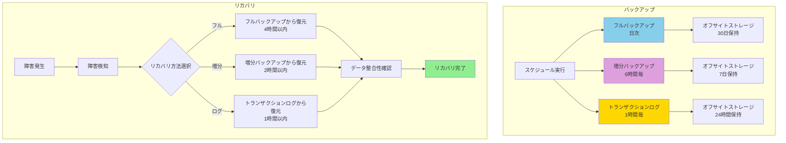
```mermaid
flowchart TD
    subgraph バックアップ
        Schedule[スケジュール実行] --> Full[フルバックアップ<br/>日次]
        Schedule --> Incremental[増分バックアップ<br/>6時間毎]
        Schedule --> Log[トランザクションログ<br/>1時間毎]
        Full --> Storage1[オフサイトストレージ<br/>30日保持]
        Incremental --> Storage2[オフサイトストレージ<br/>7日保持]
        Log --> Storage3[オフサイトストレージ<br/>24時間保持]
    end
    
    subgraph リカバリ
        Failure[障害発生] --> Detect[障害検知]
        Detect --> Select{リカバリ方法選択}
        Select -->|フル| RestoreFull[フルバックアップから復元<br/>4時間以内]
        Select -->|増分| RestoreInc[増分バックアップから復元<br/>2時間以内]
        Select -->|ログ| RestoreLog[トランザクションログから復元<br/>1時間以内]
        RestoreFull --> Verify[データ整合性確認]
        RestoreInc --> Verify
        RestoreLog --> Verify
        Verify --> Complete[リカバリ完了]
    end
    
    style Full fill:#87CEEB
    style Incremental fill:#DDA0DD
    style Log fill:#FFD700
    style Complete fill:#90EE90
```

## 10. テスト設計

### 10.1 テスト方針

| テスト種別 | 実施範囲 | 実施時期 | 責任者 |
|---|---|---|---|
| 単体テスト | 全モジュール | 開発フェーズ | 開発者 |
| 結合テスト | モジュール間連携 | 開発フェーズ | 開発者 |
| システムテスト | 全機能 | テストフェーズ | QAチーム |
| 受入テスト | 業務シナリオ | テストフェーズ | ユーザー |

#### 10.1.1 テストフロー

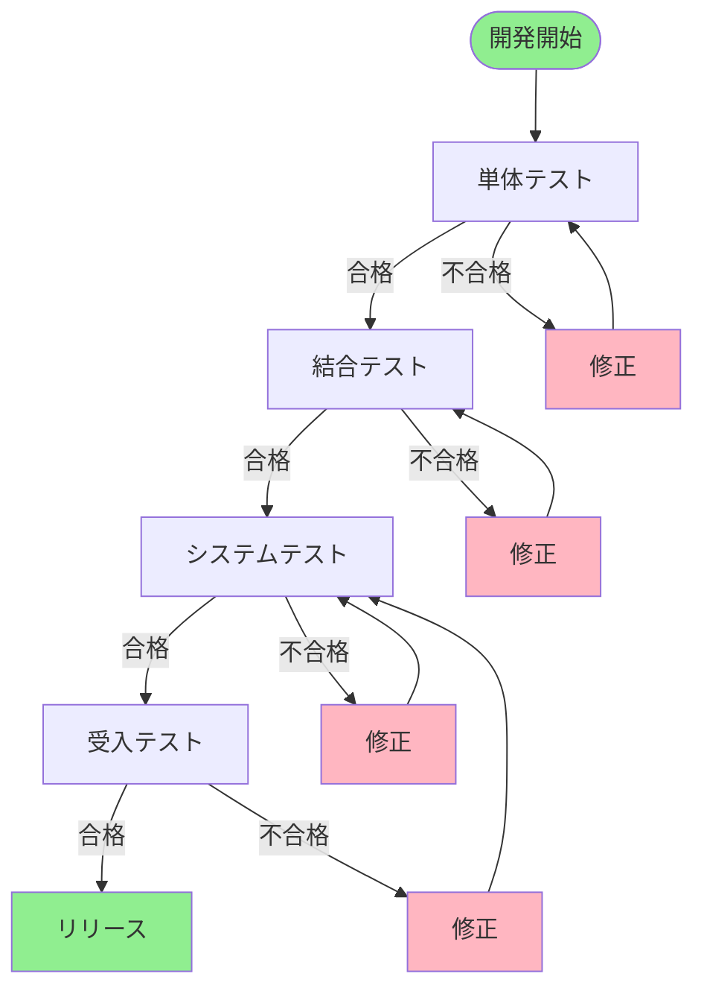
```mermaid
flowchart TD
    Start([開発開始]) --> Unit[単体テスト]
    Unit -->|合格| Integration[結合テスト]
    Unit -->|不合格| Fix1[修正]
    Fix1 --> Unit
    Integration -->|合格| System[システムテスト]
    Integration -->|不合格| Fix2[修正]
    Fix2 --> Integration
    System -->|合格| UAT[受入テスト]
    System -->|不合格| Fix3[修正]
    Fix3 --> System
    UAT -->|合格| Release[リリース]
    UAT -->|不合格| Fix4[修正]
    Fix4 --> System
    
    style Start fill:#90EE90
    style Release fill:#90EE90
    style Fix1 fill:#FFB6C1
    style Fix2 fill:#FFB6C1
    style Fix3 fill:#FFB6C1
    style Fix4 fill:#FFB6C1
```

### 10.2 テスト項目（要件対応）

| 要件ID | テスト項目 | テスト内容 | 期待結果 |
|---|---|---|---|
| REQ01 | 電子カルテ連携テスト | API連携、データ取得の正確性 | 正しくデータが取得できる |
| REQ02 | サマリー生成テスト | 生成内容の正確性、生成時間 | 30秒以内に生成、内容が正確 |
| REQ03 | 編集機能テスト | エディタ機能、データ保存 | 編集・保存が正常に動作 |
| REQ04 | 承認機能テスト | 承認フロー、データ反映 | 承認が正常に完了、電子カルテに反映 |
| REQ05 | 出力機能テスト | PDF生成、印刷機能 | PDFが正常に生成される |
| REQ08 | パフォーマンステスト | レスポンス時間、負荷テスト | 目標値を満たす |
| REQ09 | セキュリティテスト | 認証、認可、暗号化 | セキュリティ要件を満たす |
| REQ10 | 可用性テスト | 冗長化、フェイルオーバー | 可用性目標を満たす |

### 10.3 テスト環境

| 環境 | 用途 | 構成 | 備考 |
|---|---|---|---|
| 開発環境 | 開発・単体テスト | 最小構成 | |
| テスト環境 | 結合テスト・システムテスト | 本番同等構成 | |
| ステージング環境 | 受入テスト | 本番同等構成 | |
| 本番環境 | 本番運用 | 冗長構成 | |

## 11. 移行設計

### 11.1 移行方針

| 項目 | 内容 |
|---|---|
| 移行方式 | 段階的移行 |
| 移行期間 | {期間} |
| ロールバック計画 | 移行失敗時の復旧手順を事前に策定 |

#### 11.1.1 移行フロー

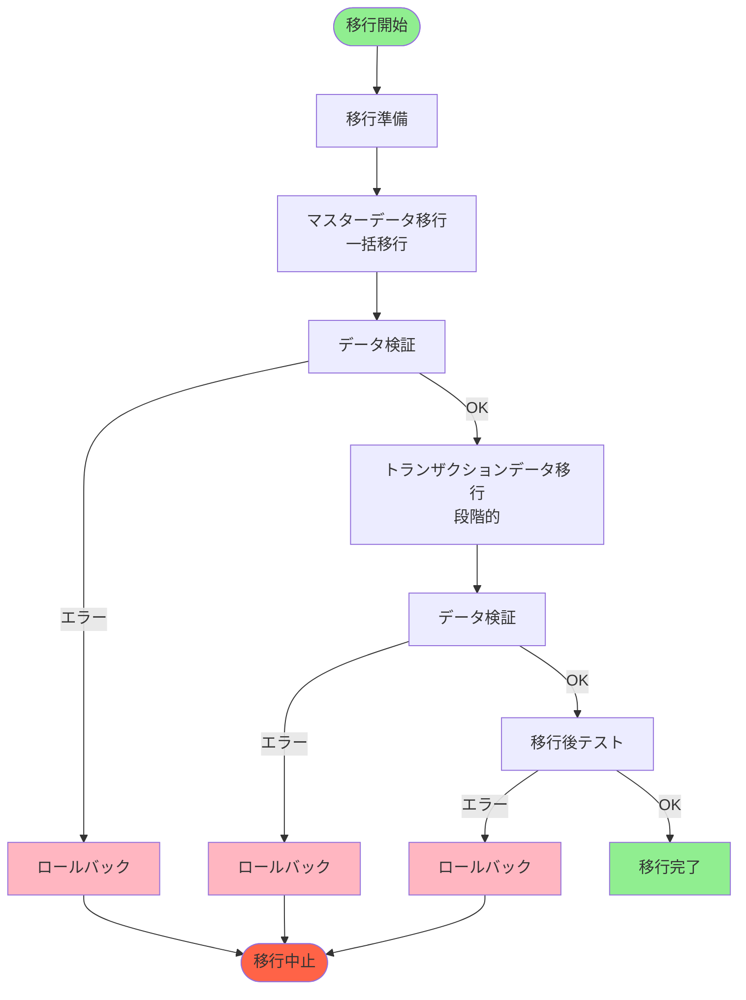
```mermaid
flowchart TD
    Start([移行開始]) --> Prep[移行準備]
    Prep --> Master[マスターデータ移行<br/>一括移行]
    Master --> Verify1[データ検証]
    Verify1 -->|エラー| Rollback1[ロールバック]
    Verify1 -->|OK| Transaction[トランザクションデータ移行<br/>段階的]
    Transaction --> Verify2[データ検証]
    Verify2 -->|エラー| Rollback2[ロールバック]
    Verify2 -->|OK| Test[移行後テスト]
    Test -->|エラー| Rollback3[ロールバック]
    Test -->|OK| Complete[移行完了]
    Rollback1 --> End([移行中止])
    Rollback2 --> End
    Rollback3 --> End
    
    style Start fill:#90EE90
    style Complete fill:#90EE90
    style Rollback1 fill:#FFB6C1
    style Rollback2 fill:#FFB6C1
    style Rollback3 fill:#FFB6C1
    style End fill:#FF6347
```

### 11.2 データ移行

| データ種別 | 移行方法 | 移行タイミング | 備考 |
|---|---|---|---|
| マスターデータ | 一括移行 | 移行開始時 | |
| トランザクションデータ | 差分移行 | 段階的 | |

## 12. 運用・保守設計

### 12.1 運用体制

| 役割 | 責任範囲 | 対応時間 | 備考 |
|---|---|---|---|
| 運用チーム | 日常監視、障害対応 | 24時間365日 | |
| 開発チーム | 障害調査、修正対応 | 営業時間内 | |
| システム管理者 | システム管理、設定変更 | 営業時間内 | |

### 12.2 保守計画

| 保守種別 | 頻度 | 内容 | 責任者 |
|---|---|---|---|
| 予防保守 | 月次 | システムチェック、ログ確認 | 運用チーム |
| 定期保守 | 四半期 | パフォーマンスチューニング | 開発チーム |
| 緊急保守 | 随時 | 障害対応、セキュリティパッチ適用 | 開発チーム |

## 13. リスク管理

### 13.1 技術リスク

| リスク | 影響度 | 発生確率 | 対策 | 責任者 |
|---|---|---|---|---|
| 電子カルテAPI仕様変更 | 高 | 中 | 仕様変更への対応計画を策定 | 開発チーム |
| パフォーマンス目標未達 | 中 | 中 | 早期の負荷テスト実施 | 開発チーム |
| セキュリティ脆弱性 | 高 | 低 | 定期的なセキュリティ監査 | セキュリティチーム |
| LLM生成品質の不安定性 | 中 | 中 | 生成結果の品質チェック機能 | 開発チーム |

### 13.2 運用リスク

| リスク | 影響度 | 発生確率 | 対策 | 責任者 |
|---|---|---|---|---|
| データ損失 | 高 | 低 | バックアップ・リカバリ計画 | 運用チーム |
| システムダウン | 高 | 低 | 冗長化、DR計画 | 運用チーム |
| 電子カルテシステム障害 | 高 | 低 | 障害時の代替手段を検討 | 運用チーム |

## 14. 更新履歴

| バージョン | 更新日 | 更新内容 | 更新者 |
|---|---|---|---|
| 1.0 | 2025年01月15日 | 初版作成 | {作成者名} |

## 15. 付録

### 15.1 参考資料

- 要件定義書（docs/req.md）
- 電子カルテシステムAPI仕様書
- 厚生労働省「医療情報システムの安全管理に関するガイドライン」

### 15.2 略語一覧

| 略語 | 正式名称 | 説明 |
|---|---|---|
| API | Application Programming Interface | アプリケーションプログラミングインターフェース |
| EMR | Electronic Medical Record | 電子医療記録 |
| PDF | Portable Document Format | ポータブルドキュメントフォーマット |
| UI | User Interface | ユーザーインターフェース |
| UX | User Experience | ユーザーエクスペリエンス |
| WYSIWYG | What You See Is What You Get | 見たまま編集できるエディタ |
| ICD-10 | International Classification of Diseases, 10th Revision | 国際疾病分類第10版 |
| JWT | JSON Web Token | JSON形式のWebトークン |
| TLS | Transport Layer Security | トランスポート層セキュリティ |
| SSL | Secure Sockets Layer | セキュアソケットレイヤー |

---

**注記**

- 本設計書は要件定義書（req.md）の要件定義リスト（REQ01～REQ20）に基づいて作成されています。
- 各設計項目は対応する要件IDを明記しており、要件とのトレーサビリティを確保しています。
- 設計の詳細化に伴い、本設計書は随時更新されます。

