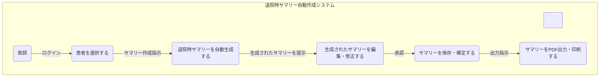
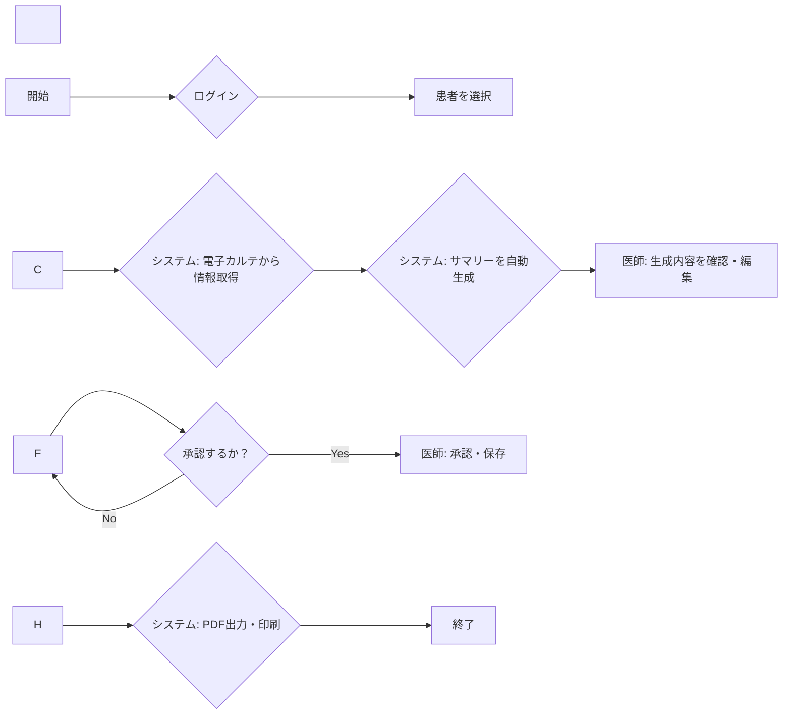

\# 要件定義書

\## 1. プロジェクト概要

\- \*\*プロジェクト名\*\*：退院時サマリー自動作成システム開発プロジェクト

\- \*\*目的\*\*：電子カルテ情報に基づき、退院時サマリーのドラフトを自動生成することで、医師の文書作成業務の負担を軽減し、医療の質の向上に貢献する。

\- \*\*背景\*\*：現在、医師は多忙な診療業務の合間を縫って退院時サマリーを作成しており、大きな負担となっている。また、作成に時間がかかることによる情報共有の遅延や、記載内容のばらつきが課題となっている。本システムにより、これらの課題を解決し、医師がより患者へのケアに集中できる環境を整備する。

\- \*\*対象ユーザー\*\*：医師、医療情報管理者

\## 2. ユースケース図

\## 3. データ要件

| データ項目名 | データ型 | 説明 |

|---|---|---|

| 患者基本情報 | オブジェクト | 氏名、患者ID、生年月日、性別、連絡先など |

| 入院情報 | オブジェクト | 入院日、退院日、入院診療科、主治医、病棟など |

| 病名情報 | 配列 | 主病名、副病名（ICD-10コードを含む） |

| 主要症状・所見 | テキスト | 入院時の主要な症状や身体所見 |

| 検査結果 | オブジェクト | 主要な血液検査、画像検査（レントゲン、CT、MRI）の所見 |

| 治療経過 | テキスト | 入院中の投薬、処置、手術などの治療内容とその経過 |

| 看護記録 | テキスト | 看護師による特記事項 |

| 退院時処方 | 配列 | 退院時に処方された薬剤情報 |

| 退院後の療養指導 | テキスト | 食事、運動、今後の通院計画などの指導内容 |

\## 4. 要件定義リスト

| 要件ID | 要件名 | 要件内容 | 優先度 | 関連セクション |

|---|---|---|---|---|

| REQ01 | 電子カルテ連携機能 | 対象患者の電子カルテシステムから、API等を通じて退院時サマリー作成に必要なデータ（患者基本情報、病名、検査結果、治療経過等）を安全に取得する機能 | 高 | 5.1 |

| REQ02 | 退院時サマリー自動生成機能 | 取得した電子カルテ情報を基に、所定のテンプレートに従って退院時サマリーのドラフトを自然言語生成技術を用いて自動で作成する機能 | 高 | 5.1 |

| REQ03 | 編集・修正機能 | 自動生成されたサマリーの内容を、医師が画面上で確認し、自由にテキストの追記、修正、削除を行えるWYSIWYGエディタ機能 | 高 | 5.1 |

| REQ04 | 承認・保存機能 | 医師が内容を確認・修正後、承認操作を行うことで、完成したサマリーを正式な文書としてシステム内に保存し、電子カルテシステムに反映させる機能 | 高 | 5.1 |

| REQ05 | 出力機能 | 完成した退院時サマリーを、指定されたフォーマットのPDFファイルとして出力、またはプリンターで印刷する機能 | 中 | 5.1 |

| REQ06 | 患者選択画面 | ヘッダー、患者検索エリア、患者一覧表示エリアで構成される画面。検索ボックス（患者ID、氏名）、患者一覧テーブル（患者ID、氏名、入院日、主治医）、サマリー作成開始ボタンを提供する | 高 | 5.2 |

| REQ07 | サマリー編集画面 | 左側に入力元となる電子カルテ情報（カルテビューア）、右側に自動生成されたサマリーの編集エリアを配置する2ペイン構成の画面。カルテ情報表示エリア、リッチテキストエディタ、保存ボタン、承認ボタン、PDF出力ボタンを提供する | 高 | 5.2 |

| REQ08 | パフォーマンス要件 | 患者を選択後、退院時サマリーのドラフトが30秒以内に生成・表示されること | 高 | 6 |

| REQ09 | セキュリティ要件 | 厚生労働省の「医療情報システムの安全管理に関するガイドライン」に準拠する。通信の暗号化（SSL/TLS）、データベースの暗号化、厳格なアクセス権限管理を行う | 高 | 6 |

| REQ10 | 可用性要件 | システムの稼働率は99.5%以上とし、計画メンテナンスを除き24時間365日利用可能であること | 中 | 6 |

| REQ11 | スケーラビリティ要件 | 将来的な利用医師数やデータ量の増加に対応可能なアーキテクチャを採用する | 中 | 6 |

| REQ12 | 患者基本情報データ取得 | 電子カルテシステムから患者の氏名、患者ID、生年月日、性別、連絡先などの基本情報を取得できること | 高 | 3 |

| REQ13 | 入院情報データ取得 | 電子カルテシステムから入院日、退院日、入院診療科、主治医、病棟などの入院情報を取得できること | 高 | 3 |

| REQ14 | 病名情報データ取得 | 電子カルテシステムから主病名、副病名（ICD-10コードを含む）を取得できること | 高 | 3 |

| REQ15 | 検査結果データ取得 | 電子カルテシステムから主要な血液検査、画像検査（レントゲン、CT、MRI）の所見を取得できること | 高 | 3 |

| REQ16 | 治療経過データ取得 | 電子カルテシステムから入院中の投薬、処置、手術などの治療内容とその経過を取得できること | 高 | 3 |

| REQ17 | 看護記録データ取得 | 電子カルテシステムから看護師による特記事項を取得できること | 中 | 3 |

| REQ18 | 退院時処方データ取得 | 電子カルテシステムから退院時に処方された薬剤情報を取得できること | 高 | 3 |

| REQ19 | 退院後の療養指導データ取得 | 電子カルテシステムから食事、運動、今後の通院計画などの指導内容を取得できること | 中 | 3 |

| REQ20 | 技術的制約への準拠 | 既存の電子カルテシステムが提供する連携APIの仕様に準拠すること。院内の閉域ネットワーク環境で動作すること | 高 | 7 |

\## 5. 機能要件

\### 5.1 主要機能

1\. \*\*電子カルテ連携機能\*\*

&nbsp;  - \*\*詳細説明\*\*：対象患者の電子カルテシステムから、API等を通じて退院時サマリー作成に必要なデータ（患者基本情報、病名、検査結果、治療経過等）を安全に取得する。

2\. \*\*退院時サマリー自動生成機能\*\*

&nbsp;  - \*\*詳細説明\*\*：取得した電子カルテ情報を基に、所定のテンプレートに従って退院時サマリーのドラフトを自然言語生成技術を用いて自動で作成する。

3\. \*\*編集・修正機能\*\*

&nbsp;  - \*\*詳細説明\*\*：自動生成されたサマリーの内容を、医師が画面上で確認し、自由にテキストの追記、修正、削除を行えるWYSIWYGエディタ機能を提供する。

4\. \*\*承認・保存機能\*\*

&nbsp;  - \*\*詳細説明\*\*：医師が内容を確認・修正後、承認操作を行うことで、完成したサマリーを正式な文書としてシステム内に保存し、電子カルテシステムに反映させる。

5\. \*\*出力機能\*\*

&nbsp;  - \*\*詳細説明\*\*：完成した退院時サマリーを、指定されたフォーマットのPDFファイルとして出力、またはプリンターで印刷する機能を提供する。

\### 5.2 画面設計

1\. \*\*患者選択画面\*\*

&nbsp;  - \*\*レイアウト\*\*：ヘッダー、患者検索エリア、患者一覧表示エリアで構成される。

&nbsp;  - \*\*主要コンポーネント\*\*：検索ボックス（患者ID、氏名）、患者一覧テーブル（患者ID、氏名、入院日、主治医）、サマリー作成開始ボタン。

2\. \*\*サマリー編集画面\*\*

&nbsp;  - \*\*レイアウト\*\*：左側に入力元となる電子カルテ情報（カルテビューア）、右側に自動生成されたサマリーの編集エリアを配置する2ペイン構成。

&nbsp;  - \*\*主要コンポーネント\*\*：カルテ情報表示エリア、リッチテキストエディタ、保存ボタン、承認ボタン、PDF出力ボタン。

\## 6. 非機能要件

\- \*\*パフォーマンス要件\*\*：患者を選択後、退院時サマリーのドラフトが30秒以内に生成・表示されること。

\- \*\*セキュリティ要件\*\*：厚生労働省の「医療情報システムの安全管理に関するガイドライン」に準拠する。通信の暗号化（SSL/TLS）、データベースの暗号化、厳格なアクセス権限管理を行う。

\- \*\*可用性要件\*\*：システムの稼働率は99.5%以上とし、計画メンテナンスを除き24時間365日利用可能であること。

\- \*\*スケーラビリティ要件\*\*：将来的な利用医師数やデータ量の増加に対応可能なアーキテクチャを採用する。

\## 7. 制約条件

\- \*\*技術的制約\*\*：既存の電子カルテシステムが提供する連携APIの仕様に準拠すること。院内の閉域ネットワーク環境で動作すること。

\- \*\*予算制約\*\*：{予算上限額}

\- \*\*スケジュール制約\*\*：{開発完了期限：YYYY年MM月DD日}

\## 8. 前提条件と仮定

\- 電子カルテシステムから、サマリー生成に必要な構造化データおよびテキストデータをAPI経由で取得可能であること。

\- 自動生成される文章の精度は100%ではないため、最終的な内容の正確性、妥当性の担保は医師による確認と修正を必須とする。

\## 9. リスクと課題

\- 電子カルテシステムとのAPI連携仕様の調整が難航するリスク。

\- 自動生成されるサマリーの文章の質が実用レベルに達しない場合、医師の修正工数が減らず、導入効果が得られないリスク。

\- 機微な医療情報を取り扱うため、情報漏洩が発生した場合の事業への影響が大きい。

\## 10. 承認

\- \*\*承認者\*\*：{病院長、情報システム部長など}

\- \*\*承認日\*\*：{YYYY年MM月DD日}

\## 11. 業務フロー図

\## 12. 更新履歴

| バージョン | 更新日 | 更新内容 | 更新者 |

|---|---|---|---|

| 1.0 | 2025年11月13日 | 初版作成 | {作成者名} |

| | | | |

| | | | |

\*\*注記\*\*

\- ユースケース図、業務フロー図は、具体的な内容に合わせて修正してください。

\- データ要件は、システムに必要となるデータ項目とその型を記述します。

\- データ型は、文字列、数値、日付など、適切な型を選択してください。

\-  Mermaid形式の図は、以下のサイトで確認できます。

&nbsp;   - \[https://mermaid.js.org/syntax/](https://mermaid.js.org/syntax/)

